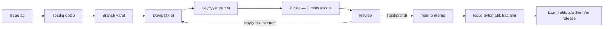

# Töhfə vermə bələdçisi

Luxe Home Estate-ə töhfə vermək istədiyiniz üçün təşəkkür edirik. Bu sənəd issue açmaqdan
pull request-in `main`-ə merge olunmasına qədər olan bütün axını izah edir.

Töhfə verməzdən əvvəl [Davranış Kodeksi](CODE_OF_CONDUCT.md) və
[Təhlükəsizlik Siyasəti](SECURITY.md) ilə tanış olun.

## Əvvəlcə

1. **Dublikat axtarın.** Yeni issue açmazdan əvvəl [mövcud issue-ları](https://github.com/MuradoffTehmez/LuxeHome/issues)
   axtarın — eyni problem artıq qeydə alınmış ola bilər.
2. **Uyğun Issue Form seçin.** Yeni issue açarkən [boş issue](https://github.com/MuradoffTehmez/LuxeHome/issues/new/choose)
   deyil, aşağıdakılardan biri seçilməlidir:
   - **Bug Report** — nasazlıq və gözlənilməyən davranış
   - **Feature Request** — yeni funksiya təklifi
   - **UI/UX Improvement** — dizayn və istifadəçi təcrübəsi
   - **Performance Issue** — yavaşlıq, gecikmə, resurs istehlakı
   - **Mobile/Responsive Issue** — mobil/planşet görünüş problemləri
   - **Documentation Issue** — README, Wiki və ya kod şərhlərindəki səhv/boşluq
3. **Təhlükəsizlik zəifliyini açıq issue kimi paylaşmayın.** [SECURITY.md](SECURITY.md)-dəki
   məxfi kanaldan istifadə edin.

## Töhfə axını



1. Issue açın və rəhbərlərdən təsdiq/istiqamət gözləyin — xüsusilə böyük dəyişikliklər üçün.
2. Issue-dan ayrıca branch yaradın (aşağıdakı adlandırma qaydasına uyğun).
3. Kiçik, məqsədli dəyişikliklər edin. Bir PR bir məqsəd daşımalıdır.
4. [Conventional Commits](https://www.conventionalcommits.org/) formatından istifadə edin.
5. Göndərmədən əvvəl lokal keyfiyyət qapısını işlədin.
6. `Closes #<issue>` olan pull request açın.
7. Review rəylərini ayrıca commit və ya məqsədli düzəlişlə cavablandırın — köhnə tarixçəni
   `--force` ilə silməyin.
8. Yalnız təsdiq və keyfiyyət qapısından keçdikdən sonra `main`-ə merge olunur.

## `main` üzərindəki qorumalar

2 sentyabr 2026-dan etibarən yuxarıdakı axın texniki olaraq məcburidir — `main`-ə birbaşa
push bağlıdır.

| Qayda | Dəyər |
|---|---|
| Birbaşa push | Bağlı — yalnız pull request |
| Məcburi yoxlama | `Quality gate` |
| Branch güncəl olmalı | Bəli |
| Təsdiq (approval) sayı | 0 |
| Linear history | Məcburi — merge commit qəbul edilmir |
| Force push / branch silmə | Bağlı |
| Administrator istisnası | Yoxdur — qayda repo sahibinə də şamil olunur |

Təsdiq sayı sıfırdır, çünki GitHub öz pull request-ini təsdiqləməyə icazə vermir və tək
işləyən adam üçün 1 təsdiq tələbi axını tamamilə bloklayardı. Komanda böyüdükdə bu dəyər
artırılmalıdır.

Solo işləyəndə də PR açılır. Səbəb review deyil, **diff-in bir yerdə görünməsidir**:
birbaşa push-da dəyişikliyin bütövlükdə necə göründüyünü heç kim, o cümlədən müəllif,
görmür.

Linear history tələb olunduğu üçün merge **squash** ilə edilir:

```bash
gh pr merge --squash --delete-branch
```

Branch-dakı commit-lər `main`-də bir addım kimi görünür, tam tarixçə isə PR-də qalır.

### Təcili hal

Qoruma administratora da şamil olunur, yəni sınıq production üçün də standart yol kiçik
hotfix/revert PR-ıdır. Qorumanı silmək bütün required check və bypass parametrlərini birdən
itirə bildiyi üçün normal incident addımı sayılmır. GitHub qaydasında dəyişiklik məcburi olarsa,
əvvəl cari konfiqurasiya ixrac edilir, dəyişiklik ayrıca incident qeydində əsaslandırılır və
iş bitən kimi UI/API nəticəsi yenidən yoxlanılır.

## Merge-dən sonra: yayım

`main`-ə merge avtomatik yayım axınını işə salır:

```text
quality → deploy-staging → e2e-staging → deploy-production
```

Hər deploy job-u öz mühitinin D1 miqrasiyalarını **bundle-dan əvvəl** tətbiq edir. Sıra
məcburidir: əvvəlcə worker yayımlansa, sxem gəlincəyə qədər sorğular çökür və xəta çox vaxt
`try/catch` içində səssizcə udulur.

Staging production-dan əvvəl gedir. Browser E2E dəsti (190+ test) canlı staging mühitinə
qarşı işləyir və uğursuz olarsa production yayımını saxlayır.

Bu, sənəd dəyişikliyinin də tam axından keçməsi deməkdir. Qəsdəndir: «bu dəyişiklik
zərərsizdir» qərarını avtomatlaşdırmaq, nəyin zərərsiz olduğunu səhv qiymətləndirmək üçün
ən qısa yoldur.

## Branch adlandırma

Kiçik ingilis hərfləri, rəqəm və tire (`-`) istifadə edin. Bir branch bir issue və bir əsas
məqsəd daşıyır.

| Prefiks | Təyinat |
|---|---|
| `feat/<issue-id>-<qisa-tesvir>` | Yeni funksiya |
| `fix/<issue-id>-<qisa-tesvir>` | Nasazlıq düzəlişi |
| `perf/<issue-id>-<qisa-tesvir>` | Performans işi |
| `docs/<issue-id>-<qisa-tesvir>` | Yalnız sənəd dəyişikliyi |
| `refactor/<issue-id>-<qisa-tesvir>` | Davranışı dəyişməyən kod yenidənqurması |
| `test/<issue-id>-<qisa-tesvir>` | Test əlavəsi/düzəlişi |
| `chore/<issue-id>-<qisa-tesvir>` | Asılılıq, konfiqurasiya, alət dəyişikliyi |
| `security/<issue-id>-<qisa-tesvir>` | Məxfi olmayan təhlükəsizlik möhkəmləndirməsi |

Nümunələr: `feat/184-ai-seo-suggestions`, `fix/205-image-upload`,
`perf/211-listing-images`.

```bash
git switch main
git pull --ff-only
git switch -c feat/184-example

git add .
git commit -m "feat(example): implement feature"
git push -u origin feat/184-example
```

## Commit mesajları

Format: `type(scope): qısa əmr cümləsi`

Tiplər: `feat`, `fix`, `perf`, `refactor`, `docs`, `test`, `build`, `ci`, `chore`, `revert`.
Commit-lər kiçik, məntiqli və atomic olmalıdır; bir-birindən asılı olmayan düzəlişləri eyni
commit-ə yığmayın və contribution statistikasını artırmaq üçün boş commit yaratmayın.

Breaking change `!` işarəsi və commit body-də `BREAKING CHANGE:` sətri ilə göstərilir:

```
feat(auth)!: sessiya cookie formatını dəyişdir

BREAKING CHANGE: köhnə sessiya cookie-ləri etibarsızdır, bütün istifadəçilər yenidən daxil olmalıdır.
```

## Keyfiyyət qapısı

Pull request açmazdan əvvəl **dörd qapının** hamısı lokal olaraq keçməlidir
(`CLAUDE.md`-dəki siyahı ilə eynidir):

```bash
npm run typecheck
npm run lint
npm test
npm run build
```

Asılılıq auditi bu dördlüyə daxil deyil — o, kod keyfiyyətini deyil, üçüncü tərəf
paketlərini yoxlayır və CI-də `Quality gate` job-unun ayrıca addımı kimi işləyir:

```bash
npm audit --audit-level=high
```

`package.json` və ya `package-lock.json`-a toxunmusunuzsa, onu da lokalda işlədin.
Yalnız kod dəyişikliyində nəticə dəyişmir.

**`npm run build`-i buraxmayın.** Digər qapılar təmiz olsa da build sınıq qala bilər:
Server Action qaydaları yalnız webpack mərhələsində yoxlanılır — `"use server"` faylındakı
hər ixrac Server Action-dır və `async` olmalıdır.

Auth, sessiya və ya səlahiyyət qatına toxunursunuzsa, dəyişiklik testlə sabitlənməlidir.
Bu qaydalar səssiz sınır: pozulanda nə build, nə də tip yoxlaması xəbər verir.

D1 sxem dəyişikliyi varsa, əlavə olaraq:

```bash
npm run db:migrate:local   # lokal D1-ə tətbiq et və yoxla
```

Miqrasiyalar həmişə geri qaytarıla bilən (reversible) olmalı və əvvəlcə lokal, sonra
staging mühitində sınanmalıdır — birbaşa production-a tətbiq edilmir.

## Kod qaydaları

- **Dil konvensiyası:** identifikatorlar (dəyişən, funksiya, tip adı) ingiliscə, şərhlər və
  istifadəçiyə görünən mətnlər azərbaycanca.
- **Domen sabitləri:** status/rol/kateqoriya dəyərləri heç vaxt hardcode edilmir —
  `src/lib/constants.ts`-dən istifadə olunur.
- **Prisma:** yalnız `src/lib/prisma.ts`-dəki singleton üzərindən (`prisma/` altındakı
  standalone scriptlər istisnadır).
- **İctimai sorğular:** yeni ictimai əmlak sorğusu mütləq `publicPropertyWhere()`
  predikatından başlamalıdır — əks halda qaralama/silinmiş qeydlər sızır.
- **Dark mode:** `dark:` prefiksi yazılmır — mövcud semantik tokenlərdən (`bg-ivory`,
  `text-ink` və s.) istifadə olunur, onlar `.dark` klassı altında öz-özünə yenidən təyin olunur.
- **Sirlər:** heç bir parol, API açarı, token və ya production məlumatı commit edilmir.

Ətraflı arxitektura və qaydalar üçün [README](README.md) və
[texniki Wiki](https://github.com/MuradoffTehmez/LuxeHome/wiki)-yə baxın.

## Pull request

PR açarkən şablonun bütün bölmələrini doldurun. Aid olmayan bölmə varsa, boş buraxmaq
əvəzinə **"Tətbiq edilmir"** yazın ki, reviewer bunun nəzərdən qaçırılmadığını bilsin.

Reviewer PR təsvirindən aşağıdakıları aydın görə bilməlidir:

- dəyişikliyin növü və məqsədi;
- test sübutu (komandalar və/və ya manual ssenari);
- UI dəyişikliyi varsa, əvvəl/sonra görüntü;
- breaking change, migration və ya deployment addımı varmı;
- rollback lazım olarsa necə ediləcək.

Review zamanı correctness, regressiya, təhlükəsizlik, performans, type safety, D1/migration,
xəta idarəsi, accessibility, mobil görünüş, SEO və maintainability ayrıca qiymətləndirilir.
Code Owner tək maintainer olduğu müddətdə məcburi approval yoxdur; komanda böyüdükdə bu qayda
aktivləşdirilir.

GitHub UI-də saxlanılan branch protection, Actions, environment, Advanced Security, label və
release parametrləri üçün [GitHub governance sənədinə](docs/github-governance.md) baxın.

## Tarixçə haqqında qeyd

2 sentyabr 2026-ya qədərki commit-lər birbaşa `main`-ə gedib, ona görə onlara uyğun pull
request yoxdur. Həmin dövrün işi geriyə dönük olaraq
[`retrospective`](https://github.com/MuradoffTehmez/LuxeHome/issues?q=label%3Aretrospective)
etiketli issue-larda (#6–#16) sənədləşdirilib — hər issue əhatəni və ona aid commit
SHA-larını saxlayır.

Töhfəniz üçün əvvəlcədən təşəkkür edirik.
