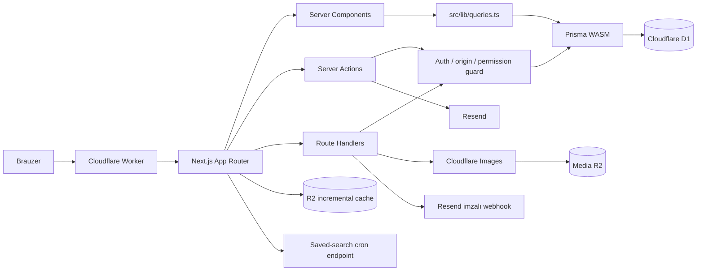
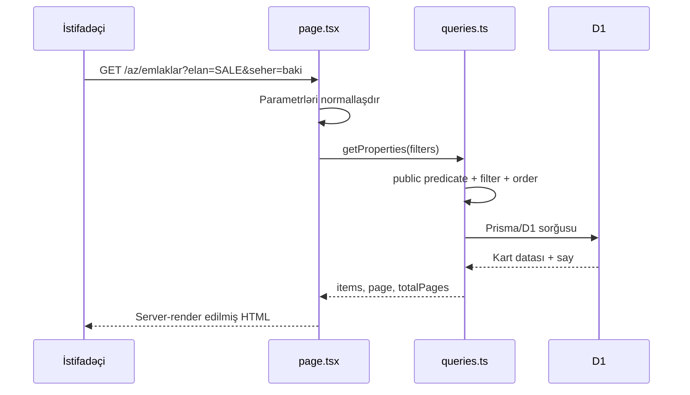

# Arxitektura

Luxe Home Estate tək Next.js tətbiqidir. İctimai sayt, istifadəçi kabineti, əməkdaş autentifikasiyası və idarə paneli eyni App Router ağacında yerləşir, lakin ayrı layout və təhlükəsizlik sərhədlərindən istifadə edir.

## Sistem topologiyası



### Əsas sərhədlər

| Sərhəd | Məsuliyyət |
|---|---|
| `src/app/[locale]/(site)` | AZ/EN/RU Navbar və Footer daxil olan ictimai sayt |
| `src/app/[locale]/(account)` | Public auth, kabinet, komanda, saxlanmış axtarış və bildirişlər |
| `src/app/admin` | Staff sessiyası və permission tələb edən idarə paneli |
| `src/app/[locale]/giris` | Məcburi TOTP-li lokallaşdırılmış əməkdaş giriş axını |
| `src/app/api` | Multipart media və hesab menyusu kimi Route Handler-lar |
| `src/lib/queries.ts` | İctimai və admin oxuma sorğularının mərkəzi qatı |
| `src/lib/auth` | Cookie, sessiya, parol, TOTP, lockout və guard-lar |
| `src/lib/admin` | Action guard, validasiya, sanitizasiya, audit və form parser-ləri |
| `src/lib/media` | R2 yazısı, şəkil yoxlaması, çevirmə və rollback |

## Render və məlumat axını

İctimai səhifələr Server Component-dir. Ana səhifə və sabit locale səhifələri SSG ola bilər; request-time D1 lazım olan detail, axtarış, sitemap və texniki marşrutlar dinamik render olunur. Tez-tez oxunan public sorğular `unstable_cache`, mərkəzi public tag-lər, D1 revalidation cədvəli və R2 incremental cache ilə idarə olunur. Runtime parametr build zamanı əlçatan olmadıqda təsdiqlənmiş `siteConfig` ehtiyat dəyərinə düşür.



Ayrıca REST oxuma API-si yoxdur. Server Components birbaşa query qatını çağırır. Mutation-lar Server Action və ya multipart fayl üçün Route Handler vasitəsilə gedir.

## İctimai data təhlükəsizlik müqaviləsi

Əmlakın ictimai görünməsi üçün üç şərt birlikdə tətbiq olunur:

```ts
{
  deletedAt: null,
  isDemo: false,
  status: { in: PUBLIC_PROPERTY_STATUSES }
}
```

`PUBLIC_PROPERTY_STATUSES` yalnız `PUBLISHED`, `RESERVED`, `SOLD` və `RENTED` dəyərlərini saxlayır. `DRAFT`, `PENDING`, `ARCHIVED`, soft-delete və demo qeydləri ictimai sorğulara düşmür.

Eyni prinsip layihə və bloqda `deletedAt`, `isDemo`, aktivlik və publish statusu ilə tətbiq edilir.

Tərəfdaş public sorğusu `deletedAt: null`, `status: ACTIVE`, `verified`, `officialPartner` və `showPublicly` şərtlərinin mərkəzi birləşməsindən keçir. Müqavilə və daxili qeydlər public select-lərə daxil edilmir.

## Query və UI data müqaviləsi

Kartlar tam Prisma qeydini almır. `src/lib/queries.ts` aşağıdakı select-ləri ixrac edir:

- `propertyCardSelect` → `PropertyCardData`;
- `projectCardSelect` → `ProjectCardData`;
- `postCardSelect` → `PostCardData`;
- `compareSelect` → `ComparePropertyData`.

Komponent tipləri `Prisma.*GetPayload` ilə bu select-lərdən törəyir. Select və UI ehtiyacı ayrıldıqda TypeScript bunu build-dən əvvəl aşkarlayır.

## Prisma və D1

`src/lib/prisma.ts` D1 binding-i üçün lazy `Proxy` yaradır. Modul import ediləndə deyil, ilk property access zamanı `getCloudflareContext().env.DB` oxunur. Bu, build mərhələsində binding olmadığı üçün tətbiqin çökməsinin qarşısını alır.

Runtime kodunda ayrıca `new PrismaClient()` yaratmaq olmaz. İstisna yalnız `prisma/` altındakı standalone generator və bootstrap skriptləridir.

Prisma generatorunun standart output-u qəsdən saxlanılıb. Paket adı ilə import `workerd` üçün WASM client-in seçilməsinə imkan verir; xüsusi output Node binary engine-i bundle edə bilər.

## Yazma əməliyyatları

### Admin mutation

Hər admin mutation-ı `requireAdminAction(permission)` qapısından keçir:

1. `Sec-Fetch-Site` və `Origin` ilə same-origin yoxlaması;
2. imzalanmış cookie və D1-də canlı sessiya;
3. staff hesab növü və `STAFF_2FA` auth növü;
4. rol/icazə matrisi;
5. `ADMIN_LIMIT` ilə istifadəçi və scope əsaslı sürət limiti;
6. uğurlu kritik əməliyyat üçün `AuditLog`.

### İctimai kabinet mutation-ı

`requirePublicAction("media" | "property")` eyni origin və write-limit qatını istifadə edir, lakin yalnız `OWNER` və `AGENCY` hesab növlərinə icazə verir. Public action forma gövdəsindən status, müəllif, featured və SEO kimi admin sahələrini qəbul etmir.

D1 interactive transaction vermədiyi axınlarda kompensasiya tətbiq olunur. Məsələn, elan yaradılıb relation yazısı uğursuz olarsa əsas `Property` sətri silinir; R2 yazısından sonra `Media` sətri yaranmasa R2 obyekti geri silinir.

## Media arxitekturası

Media axını:

1. 8 MB limit;
2. JPEG, PNG, WebP və AVIF allowlist;
3. `Content-Type` əvəzinə magic-byte təsdiqi;
4. SVG qadağası;
5. Cloudflare Images ilə maksimum 2400 px WebP master;
6. maksimum 640 px thumbnail;
7. serverdə yaranan UUID əsaslı R2 açarı;
8. uzunmüddətli immutable cache metadata;
9. `Media` modelində ölçü, MIME, alt mətn və uploader qeydi;
10. `/media/[...key]` vasitəsilə delivery.

Cloudflare Images binding-i lokal mühitdə yoxdursa original baytlar saxlanır; production-da çevirmə cəhdi uğursuz olarsa elan şəkilsiz qalmasın deyə original format fallback kimi yazılır.

## Cloudflare resursları

| Binding | Rol |
|---|---|
| `DB` | Prisma adapterinin istifadə etdiyi D1 bazası |
| `MEDIA` | Yüklənən şəkillər üçün R2 bucket |
| `NEXT_INC_CACHE_R2_BUCKET` | OpenNext ISR/revalidate nəticələri |
| `IMAGES` | Şəkil məlumatı və WebP transformasiyası |
| `LOGIN_LIMIT` | Login və qeydiyyat IP limiti |
| `CONTACT_LIMIT` | Əlaqə forması üçün IP əsaslı limit; honeypot və origin qapısından sonra işləyir |
| `ADMIN_LIMIT` | Admin və public kabinet mutation limit-i |
| `WORKER_SELF_REFERENCE` | OpenNext revalidation self-reference |
| `ASSETS` | Build statik asset-ləri |
| `NEXT_TAG_CACHE_D1` | OpenNext tag revalidation metadata-sı (`revalidations`) |

Production və staging üçün D1, R2, rate-limit namespace və Worker adları ayrıdır. `env.staging.routes = []` production custom domain-in staging Worker-ə keçməsinin qarşısını alır.

## URL-state və əmlak filtr müqaviləsi

Filtrlərin həqiqət mənbəyi URL query parametrləridir. `SearchPanel` cari vəziyyəti `useSearchParams` ilə deyil, server səhifəsindən gələn `initial` propu ilə alır. Bu yanaşma ana səhifənin statik render imkanını qoruyur.

Əsas parametrlər: `elan`, `axtaris`, `tip`, `seher`, `rayon`, `metro`, `otaq`, `min`, `max`, `sahe_min`, `sahe_max`, `temir`, `sened`, `tikili`, `dovr`, `mertebe_min`, `mertebe_max`, `ilk_mertebe_yox`, `son_mertebe_yox`, `sekilli`, `xususiyyet`, `siralama`, `sehife`.

## Lokallaşdırma sərhədi

`next-intl` bütün istifadəçi səhifələrini həmişə locale prefiksi ilə təqdim edir: `/az`, `/en`, `/ru`. Prefikssiz köhnə public URL-lər middleware ilə uyğun locale-a yönləndirilir. `/admin`, `/api`, `/media`, sitemap, robots və `llms.txt` locale ağacından kənardadır. Köhnə `/{locale}/admin/...` ünvanları 308 ilə canonical `/admin/...` yoluna keçir.

Kontentdə AZ əsas dildir. Tərəfdaşın EN/RU sahəsi boş olduqda AZ mətni fallback kimi göstərilir; UI mətnləri locale JSON namespace-lərindən gəlir.

## SEO qatı

`src/lib/seo.ts` aşağıdakı generatorları mərkəzləşdirir:

- `buildMetadata()` — title, description, canonical, Open Graph, Twitter və noindex;
- `organizationSchema()` — `RealEstateAgent`;
- `websiteSchema()`;
- `propertySchema()` — `Product` + `Offer`;
- `articleSchema()`;
- `serviceSchema()`;
- agentlik, tərəfdaş, FAQ və siyahı struktur datası;
- `breadcrumbSchema()`;
- `jsonLd()`.

`SITE_URL` həm build, həm Worker runtime-da eyni mühitə uyğun ötürülməlidir. `IS_STAGING=true` bütün `buildMetadata` çağırışlarını noindex edir və `robots.ts` bütün staging route-larını bloklayır.

## Asinxron əməliyyatlar

- Əlaqə və saved-search e-poçtları Resend vasitəsilə göndərilir.
- `luxehomeestate-cron` adlı ayrıca scheduled Worker hər gün 05:00 UTC-də qorunan `/api/cron/saved-search-digest` endpoint-inə `CRON_SECRET` ilə POST edir.
- `/api/webhooks/resend` Svix imzasını `RESEND_WEBHOOK_SECRET` ilə yoxlayır və məktub məzmununu deyil, `EmailActivity` çatdırılma/qəbul metadatasını saxlayır.
- `DomainEvent` kritik domen hadisələri üçün yüngül outbox rolunu daşıyır; tam event sourcing deyil.

## Dizayn sistemi

Tailwind v4 tokenləri `src/app/globals.css`-dədir. Dark mode komponentlərdə `dark:` variantı ilə deyil, `.dark` altında eyni semantik dəyişənlərin yenidən təyini ilə işləyir.

Yeni UI:

- `bg-ivory`, `bg-paper`, `text-ink`, `text-ink-soft`, `border-line` kimi tokenlərdən istifadə etməlidir;
- klaviatura fokusunu gizlətməməlidir;
- `Section` boşluğunu `spacing` propu ilə idarə etməlidir;
- `prefers-reduced-motion` davranışını qorumalıdır;
- şirkət məlumatını `src/config/site.ts` xaricində hardcode etməməlidir.

## Repozitoriya quruluşu

```text
luxehome/
├── migrations/          D1 SQL miqrasiyaları
├── prisma/              sxem, seed, taksonomiya və bootstrap skriptləri
├── public/              statik asset-lər
├── scripts/             loqo və e-poçt köməkçiləri
├── src/app/             route-lar, actions və route handler-lar
├── src/components/      admin, site və UI komponentləri
├── src/config/          mərkəzi sayt konfiqurasiyası
├── src/lib/             query, auth, admin, media, SEO və utilitlər
├── next.config.ts       Next.js, images, header və dev binding-ləri
├── open-next.config.ts  R2 incremental cache
└── wrangler.jsonc       production/staging Cloudflare konfiqurasiyası
```

## Portativlik qeydləri

- Runtime bazası D1/SQLite-dir; yeni sorğular SQLite-a xas qeyri-standart davranışa bağlanmamalıdır.
- D1 Prisma `mode: "insensitive"` parametrini dəstəkləmir.
- SQLite `LIKE` Azərbaycan hərflərində tam registrsiz deyil.
- Sütun müqayisəsi kimi bəzi filtr şərtləri Prisma field reference istifadə edir; provider dəyişəndə ayrıca test tələb edir.
