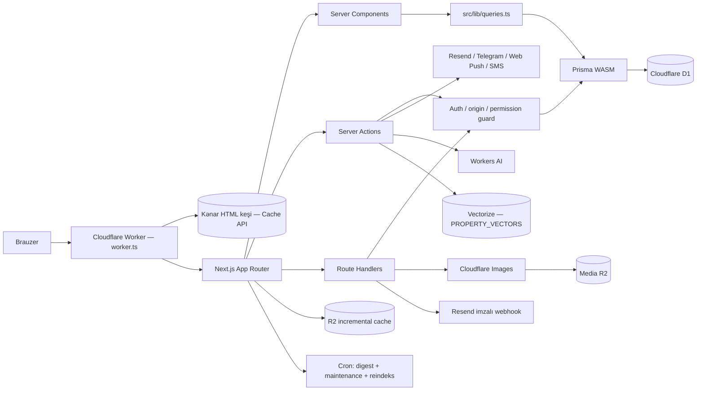
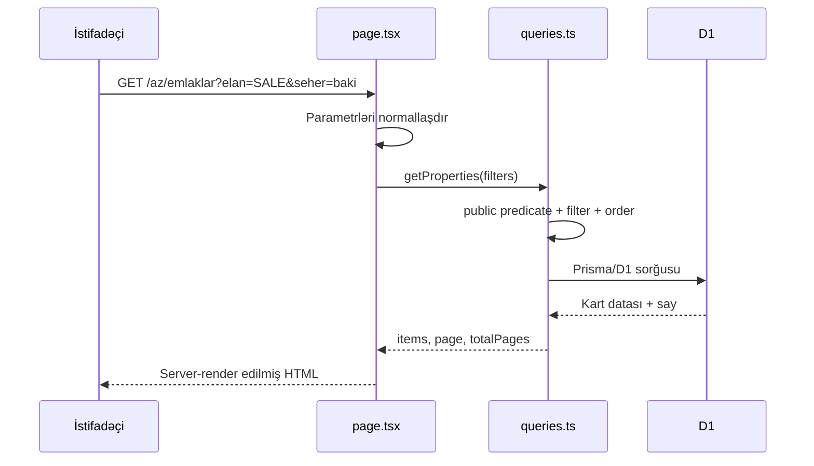

# Arxitektura

Luxe Home Estate tək Next.js tətbiqidir. İctimai sayt, istifadəçi kabineti, əməkdaş autentifikasiyası və idarə paneli eyni App Router ağacında yerləşir, lakin ayrı layout və təhlükəsizlik sərhədlərindən istifadə edir.

## Sistem topologiyası


```mermaid
flowchart LR
    B[Brauzer] --> W[Cloudflare Worker — worker.ts]
    W --> EC[(Kənar HTML keşi — Cache API)]
    W --> N[Next.js App Router]
    N --> SC[Server Components]
    N --> SA[Server Actions]
    N --> RH[Route Handlers]
    SC --> Q[src/lib/queries.ts]
    Q --> P[Prisma WASM]
    SA --> G[Auth / origin / permission guard]
    G --> P
    RH --> G
    P --> D1[(Cloudflare D1)]
    RH --> I[Cloudflare Images]
    I --> R2[(Media R2)]
    N --> C[(R2 incremental cache)]
    SA --> E[Resend / Telegram / Web Push / SMS]
    RH --> WH[Resend imzalı webhook]
    N --> CR[Cron: digest + maintenance + reindeks]
    SA --> AI[Workers AI]
    SA --> V[(Vectorize — PROPERTY_VECTORS)]
```

### Əsas sərhədlər

| Sərhəd | Məsuliyyət |
|---|---|
| `src/app/[locale]/(site)` | AZ/EN/RU Navbar və Footer daxil olan ictimai sayt |
| `src/app/[locale]/(account)` | Public auth, kabinet, komanda, saxlanmış axtarış və bildirişlər |
| `src/app/admin` | Staff sessiyası və permission tələb edən idarə paneli |
| `src/app/[locale]/giris` | Məcburi TOTP-li lokallaşdırılmış əməkdaş giriş axını |
| `src/app/api` | Media, Google OAuth, ICS təqvim, OG kartı, geocode/tile, monitorinq, cron və webhook Route Handler-ları |
| `worker.ts` | OpenNext worker-ini sarır: anonim ictimai HTML-i Cache API-də saxlayır, OpenNext-in Durable Object siniflərini (`DOQueueHandler`, `DOShardedTagCache`, `BucketCachePurge`) yenidən ixrac edir |
| `src/middleware.ts` | Locale yönləndirməsi, admin/kabinet cookie imzası, sistem rejimi qapısı və sərtləşdirmə başlıqları |
| `src/lib/queries.ts` | İctimai və admin oxuma sorğularının mərkəzi qatı |
| `src/lib/auth` | Cookie, sessiya, parol, TOTP, lockout və guard-lar |
| `src/lib/admin` | Action guard, validasiya, sanitizasiya, audit və form parser-ləri |
| `src/lib/media` | R2 yazısı, şəkil yoxlaması, çevirmə, su nişanı və rollback |
| `src/lib/accounts` | Hesab növləri, profil sahələri, qısa ünvanlar |
| `src/lib/location-*.ts`, `regions.ts`, `az-collation.ts` | Ərazi ağacı, tam ünvan formatı, iqtisadi rayonlar, Azərbaycan əlifbası ilə sıralama |
| `src/i18n` | Locale routing, ictimai kataloqlar, ayrıca `admin` namespace-i |

## Render və məlumat axını

İctimai səhifələr Server Component-dir. Ana səhifə və sabit locale səhifələri SSG ola bilər; request-time D1 lazım olan detail, axtarış, sitemap və texniki marşrutlar dinamik render olunur. Tez-tez oxunan public sorğular `unstable_cache`, mərkəzi public tag-lər, D1 revalidation cədvəli və R2 incremental cache ilə idarə olunur. Runtime parametr build zamanı əlçatan olmadıqda təsdiqlənmiş `siteConfig` ehtiyat dəyərinə düşür.


```mermaid
sequenceDiagram
    participant U as İstifadəçi
    participant P as page.tsx
    participant Q as queries.ts
    participant DB as D1

    U->>P: GET /az/emlaklar?elan=SALE&seher=baki
    P->>P: Parametrləri normallaşdır
    P->>Q: getProperties(filters)
    Q->>Q: public predicate + filter + order
    Q->>DB: Prisma/D1 sorğusu
    DB-->>Q: Kart datası + say
    Q-->>P: items, page, totalPages
    P-->>U: Server-render edilmiş HTML
```

Ayrıca REST oxuma API-si yoxdur. Server Components birbaşa query qatını çağırır. Mutation-lar Server Action və ya multipart fayl üçün Route Handler vasitəsilə gedir.

Public ağacda route səviyyəli `loading.tsx` qəsdən istifadə edilmir: Suspense streaming başlıqları erkən göndərib `notFound()` cavablarının 404 statusunu poza bilər. Keçid geribildirimi `(site)/template.tsx` və `NavigationProgress` ilə verilir.

## Kənar HTML keşi

`wrangler.jsonc`-in `main`-i `worker.ts`-dir. O, anonim ictimai HTML-i Cloudflare Cache API-də `EDGE_HTML_CACHE_TTL` saniyə (production-da 60) saxlayır. Qaydalar `src/lib/edge-html-cache.ts` və `public-cache-policy.ts`-dədir:

- sessiya/2FA/preview cookie-li sorğu, sessiya oxuyan marşrut, panel, auth və API keşdən keçmir;
- açar RSC/router başlıqlarını daxil edir; `Set-Cookie` saxlanmır;
- `IS_STAGING` olan mühitdə (staging, lokal E2E) keş söndürülüdür.
- sistem rejimi `NORMAL` deyilsə və ya `FORCE_MAINTENANCE="true"`-dursa keş nə oxunur, nə yazılır (`systemModeAllowsCache()`), ki texniki xidmət səhifəsi dərhal görünsün;
- cavab `x-edge-cache: HIT|MISS` başlığı daşıyır, brauzerə isə `private, no-cache` verilir — yeniləmə yalnız kənarda idarə olunur.

Yeni ictimai səhifə server tərəfdə sessiya oxuyursa `SESSION_DEPENDENT_PUBLIC_ROUTES`-a əlavə olunmalıdır, əks halda bir istifadəçinin HTML-i başqasına verilə bilər (`public-cache-safety.test.ts` qoruyur). Admin dəyişikliyi anonim ziyarətçiyə ən çox 60 saniyə gecikmə ilə çatır.

## İctimai data təhlükəsizlik müqaviləsi

Əmlakın ictimai görünməsi üçün üç şərt birlikdə tətbiq olunur:

```ts
// publicPropertyWhere() — async, çünki demo rejimini oxuyur
{
  deletedAt: null,
  status: { in: PUBLIC_PROPERTY_STATUSES },
  ...(await demoWhere()) // rejim bağlıdırsa { isDemo: false }
}
```

Yeni ictimai əmlak sorğusu mütləq bu şərtdən başlamalıdır. Sitemap, SEO auditi və landing indeksləşdirmə qərarı isə sinxron `indexablePropertyWhere()` / `indexablePartnerWhere()` işlədir — onlar həmişə `isDemo: false` daşıyır.

`PUBLIC_PROPERTY_STATUSES` yalnız `PUBLISHED`, `RESERVED`, `SOLD` və `RENTED` dəyərlərini saxlayır. `DRAFT`, `PENDING`, `ARCHIVED`, soft-delete və demo qeydləri ictimai sorğulara düşmür.

Eyni prinsip layihə və bloqda `deletedAt`, `isDemo`, aktivlik və publish statusu ilə tətbiq edilir.

Tərəfdaş public sorğusu `deletedAt: null`, `status: ACTIVE`, `verified`, `officialPartner` və `showPublicly` şərtlərinin mərkəzi birləşməsindən keçir. Müqavilə və daxili qeydlər public select-lərə daxil edilmir.

## Query və UI data müqaviləsi

Kartlar tam Prisma qeydini almır. `src/lib/queries.ts` aşağıdakı select-ləri ixrac edir:

- `propertyCardSelect` → `PropertyCardData`;
- `projectCardSelect` → `ProjectCardData`;
- `postCardSelect` → `PostCardData`;
- `compareSelect` → `ComparePropertyData`.

Komponent tipləri `Prisma.*GetPayload` ilə bu select-lərdən törəyir. Select və UI ehtiyacı ayrıldıqda TypeScript bunu build-dən əvvəl aşkarlayır.

## Prisma və D1

`src/lib/prisma.ts` D1 binding-i üçün lazy `Proxy` yaradır. Modul import ediləndə deyil, ilk property access zamanı `getCloudflareContext().env.DB` oxunur. **Klient sorğu başına yaradılır** (OpenNext `ctx` açarlı `WeakMap`): izolyat boyu paylaşılan klient yarımçıq kəsilmiş sorğuda ilişəndə sonrakı bütün sorğular workerd tərəfindən «hung» kimi 500-ə çevrilirdi (#96).

Prisma klienti `@prisma/client/wasm.js`-dən idxal olunur — sadəcə `@prisma/client` yazılsa esbuild `node` şərtini seçir və Workers-də olmayan binary engine-i yükləməyə çalışır.

D1 məhdudiyyətləri:

- transaction yoxdur — kompensasiya, şərti `updateMany` və idempotent marker-lər işlədilir;
- bir sorğuda ən çox 100 bound parametr — uzun id siyahısında `findManyInChunks()` (`d1-chunks.ts`);
- `take`/`orderBy`-li nested əlaqə 98-dən çox valideyndə sorğunu ilişdirir — böyük siyahıda əlaqəni ayrıca yüklə (`withMapImages()`).

Runtime kodunda ayrıca `new PrismaClient()` yaratmaq olmaz. İstisna yalnız `prisma/` altındakı standalone generator və bootstrap skriptləridir.

Prisma generatorunun standart output-u qəsdən saxlanılıb. Paket adı ilə import `workerd` üçün WASM client-in seçilməsinə imkan verir; xüsusi output Node binary engine-i bundle edə bilər.

## Yazma əməliyyatları

### Admin mutation

Hər admin mutation-ı `requireAdminAction(permission)` qapısından keçir:

1. `Sec-Fetch-Site` və `Origin` ilə same-origin yoxlaması;
2. imzalanmış cookie və D1-də canlı sessiya;
3. staff hesab növü və `STAFF_2FA` auth növü;
4. rol/icazə matrisi;
5. `ADMIN_LIMIT` ilə istifadəçi və scope əsaslı sürət limiti;
6. uğurlu kritik əməliyyat üçün `AuditLog`.

### İctimai kabinet mutation-ı

`requirePublicAction("media" | "property")` eyni origin və write-limit qatını istifadə edir, lakin yalnız elan yerləşdirə bilən hesab növlərinə (`LISTING_ACCOUNT_TYPES`) icazə verir. Public action forma gövdəsindən status, müəllif, featured və SEO kimi admin sahələrini qəbul etmir.

D1 interactive transaction vermədiyi axınlarda kompensasiya tətbiq olunur. Məsələn, elan yaradılıb relation yazısı uğursuz olarsa əsas `Property` sətri silinir; R2 yazısından sonra `Media` sətri yaranmasa R2 obyekti geri silinir.

## Media arxitekturası

Media axını:

0. brauzerdə kiçiltmə, növbə və retry (toplu yükləmə, `clientUploadId` ilə idempotent);
1. 8 MB limit;
2. JPEG, PNG, WebP və AVIF allowlist;
3. `Content-Type` əvəzinə magic-byte təsdiqi;
4. SVG qadağası;
5. Cloudflare Images ilə maksimum 2400 px WebP master;
6. maksimum 640 px thumbnail;
7. serverdə yaranan UUID əsaslı R2 açarı;
8. uzunmüddətli immutable cache metadata;
9. `Media` modelində ölçü, MIME, alt mətn və uploader qeydi;
10. `/media/[...key]` vasitəsilə delivery;
11. elan şəkli üçün su nişanı: ölçü və məsafə şəkil eninə nisbətdir; nişanlı şəkil bayt izi (`Media.checksum`) və ya piksel korrelyasiyası ilə tanınır və ikinci dəfə nişanlanmır. Production-da nişan çəkilə bilməsə yükləmə 503 ilə təkrar cəhdə qaytarılır. Elan şəkli yalnız `/media/emlaklar/` qovluğundan qəbul olunur (`isListingMediaUrl`).

Cloudflare Images binding-i lokal mühitdə yoxdursa original baytlar saxlanır; production-da çevirmə cəhdi uğursuz olarsa elan şəkilsiz qalmasın deyə original format fallback kimi yazılır.

## Cloudflare resursları

| Binding | Rol |
|---|---|
| `DB` | Prisma adapterinin istifadə etdiyi D1 bazası |
| `MEDIA` | Yüklənən şəkillər üçün R2 bucket |
| `NEXT_INC_CACHE_R2_BUCKET` | OpenNext ISR/revalidate nəticələri |
| `IMAGES` | Şəkil məlumatı və WebP/JPEG transformasiyası |
| `AI` | Workers AI (mətn, vision, `bge-m3` embedding) |
| `PROPERTY_VECTORS` | Vectorize indeksi (`luxehome-properties[-staging]`, 1024/cosine) |
| `LOGIN_LIMIT` | Login və qeydiyyat IP limiti (10/60 s) |
| `CONTACT_LIMIT` | Əlaqə forması (5/60 s) |
| `ADMIN_LIMIT` | Admin və kabinet mutation limit-i (60/60 s) |
| `MONITORING_LIMIT` | Client xəta/Web Vitals qəbulu (60/60 s) |
| `TILE_LIMIT` | Xəritə tile proksisi, yalnız keş boş olanda (240/60 s) |
| `AI_LIMIT` | İctimai AI axtarışı və məsləhətçi (12/60 s) |
| `VALUATION_LIMIT` | «Evimi qiymətləndir» (20/60 s) |
| `WORKER_SELF_REFERENCE` | OpenNext revalidation self-reference |
| `ASSETS` | Build statik asset-ləri |
| `NEXT_TAG_CACHE_D1` | OpenNext tag revalidation metadata-sı (`revalidations`) |

Production və staging üçün D1, R2, rate-limit namespace və Worker adları ayrıdır. `env.staging.routes = []` production custom domain-in staging Worker-ə keçməsinin qarşısını alır.

## URL-state və əmlak filtr müqaviləsi

Filtrlərin həqiqət mənbəyi URL query parametrləridir. `SearchPanel` cari vəziyyəti `useSearchParams` ilə deyil, server səhifəsindən gələn `initial` propu ilə alır. Bu yanaşma ana səhifənin statik render imkanını qoruyur.

Əsas parametrlər: `elan`, `axtaris`, `tip`, `seher`, `rayon`, `metro`, `nisangah`, `metro_yaxin`, `sahe`, `otaq`, `min`, `max`, `sahe_min`, `sahe_max`, `temir`, `sened`, `tikili`, `dovr`, `mertebe_min`, `mertebe_max`, `ilk_mertebe_yox`, `son_mertebe_yox`, `sekilli`, `xususiyyet`, `siralama`, `sehife`.

## Yerləşmə data axını

Ərazi bölgüsü generasiya olunan dataya əsaslanır; kodda əl ilə yazılmış siyahı yoxdur:

```
DSK təsnifatı (az-admin-divisions.json) ┐
Ünvan Reyestri (unvanportali-*.json)    ├─ db:locations:build ─► prisma/locations-data.ts ─► db:taxonomy:build ─► taxonomy.sql / miqrasiya
bazar massivləri (baku-market-locations)┘
Ünvan Reyestri küçələri (~63 000) ─ db:streets:build ─► public/data/kuceler/<kod>.json (3 476 fayl) + src/lib/official-street-codes.ts
                                              db:locations:report ─► docs/erazi/baki-erazi-bolgusu.md
                                              db:locations:migrations ─► migrations/0050–0053
```

- ~63 000 rəsmi küçə Worker bundle-ına və D1-ə düşmür: `public/` altında statik fayldır, CDN-dən keşlənir və yalnız elan forması açılanda yüklənir. `official-street-codes.ts` faylı olmayan kodu soruşmağın (404) qarşısını alır.
- CI yalnız `migrations/`-ı tətbiq etdiyi üçün taksonomiya dəyişikliyi production-a özü-yetərli miqrasiya ilə çatır (`0031`, `0050`–`0053`).
- ~3 600 kənd filtr/forma payload-una bir dəfədə düşmür: filtrdə elanı olanlar, formada seçilmiş rayonunkular (`/api/yerler/kendler`).
- Nişangahlar AI axtarışının promptuna göndərilmir (token qənaəti); semantik axtarışın embedding mətninə isə daxildir.
- Ətraflı qaydalar və yeniləmə runbook-u: [[Ərazi bölgüsü və ünvan|Location-Taxonomy]].

## Lokallaşdırma sərhədi

`next-intl` bütün istifadəçi səhifələrini həmişə locale prefiksi ilə təqdim edir: `/az`, `/en`, `/ru`. Prefikssiz köhnə public URL-lər middleware ilə uyğun locale-a yönləndirilir. `/admin`, `/api`, `/media`, sitemap, robots və `llms.txt` locale ağacından kənardadır. Köhnə `/{locale}/admin/...` ünvanları 308 ilə canonical `/admin/...` yoluna keçir.

Kontentdə AZ əsas dildir. Tərəfdaşın EN/RU sahəsi boş olduqda AZ mətni fallback kimi göstərilir; UI mətnləri locale JSON namespace-lərindən gəlir.

### Admin panelin dili

`/admin` locale prefiksi daşımır, ona görə dil URL-də deyil, `User.locale`-dadır:

- `src/i18n/admin.ts` — `admin` namespace-i; `MESSAGE_NAMESPACES`-ə salınmır (əks halda hər ictimai sorğu panel mesajlarını yükləyərdi);
- server komponentləri `await getAdminT()` işlədir, `useTranslations()` yox (o, `/admin` üçün həmişə AZ-a düşər);
- client komponentləri `useTranslations("admin")` işlədir; mesajlar `admin/layout.tsx`-dəki provider-dən gəlir;
- etiket siyahıları modul sabiti kimi deyil, `(t) => [...]` funksiyası kimi saxlanılır;
- `*_LABELS` domen mənbəyidir, panel `labels.*` kataloqundan oxuyur; sinxronluğu `admin-label-sync.test.ts` qoruyur.

## SEO qatı

`src/lib/seo.ts` aşağıdakı generatorları mərkəzləşdirir:

- `buildMetadata()` — title, description, canonical, Open Graph, Twitter və noindex;
- `organizationSchema()` — `RealEstateAgent`;
- `websiteSchema()`;
- `propertySchema()` — `Product` + `Offer`;
- `articleSchema()`;
- `serviceSchema()`;
- agentlik, tərəfdaş, FAQ və siyahı struktur datası;
- `breadcrumbSchema()`;
- `jsonLd()`.

`SITE_URL` həm build, həm Worker runtime-da eyni mühitə uyğun ötürülməlidir. `IS_STAGING=true` bütün `buildMetadata` çağırışlarını noindex edir və `robots.ts` bütün staging route-larını bloklayır.

## Asinxron əməliyyatlar

- Əlaqə və saved-search e-poçtları Resend vasitəsilə göndərilir.
- `luxehomeestate-cron` adlı ayrıca scheduled Worker hər gün 05:00 UTC-də qorunan `/api/cron/saved-search-digest` endpoint-inə `CRON_SECRET` ilə POST edir. Endpoint paralel olaraq digest-i, `runPhase2Maintenance()`-i (elan müddəti, xatırlatma, arxiv, hesab silinməsinin retry-si) və tam semantik reindeksi işlədir.
- Elan yazan hər action fonda `queuePropertyVectorSync()` və `queueListingEnrichment()` çağırır — xəta action-u sındırmır. Vectorize binding-i yoxdursa (lokal E2E) axtarış leksik rejimə düşür.
- Telegram lead bildirişi (`notifyLeadOnTelegram()`) heç vaxt atmır; secret yoxdursa səssizcə buraxılır.
- `/api/webhooks/resend` Svix imzasını `RESEND_WEBHOOK_SECRET` ilə yoxlayır və məktub məzmununu deyil, `EmailActivity` çatdırılma/qəbul metadatasını saxlayır.
- `DomainEvent` kritik domen hadisələri üçün yüngül outbox rolunu daşıyır; tam event sourcing deyil.

## Dizayn sistemi

Tailwind v4 tokenləri `src/app/globals.css`-dədir. Dark mode komponentlərdə `dark:` variantı ilə deyil, `.dark` altında eyni semantik dəyişənlərin yenidən təyini ilə işləyir.

2026 yenilənməsi (#91–#102) konvensiyaları:

- radius şkalası: xs 6 · sm 10 · md 12 · lg 16 · xl 20 · 2xl 28 px; düymə/input `rounded-sm`, kart `rounded-lg`/`rounded-xl`, badge `rounded-full`;
- `card-surface` və `on-image-chip` `@layer components` içindədir;
- foto üzərində `charcoal`/`navy` tokeni işlədilmir — tünd rejimdə açığa dönür; sabit `black/<opacity>` və ya `on-image-chip`;
- serif (Playfair) yalnız səhifə/bölmə başlıqlarında; admin başlıqlarında `font-display` yoxdur;
- yalnız breakpoint-də sütun verən grid-ə baza `grid-cols-1` yazılır; `overflow-x-auto` konteyneri `relative` olmalıdır;
- fixed/sticky səthlər `--safe-*` və `--bottom-nav-offset` dəyişənlərini işlədir;
- px arbitrary breakpoint əvəzinə rem (`min-[85rem]:`).

Yeni UI:

- `bg-ivory`, `bg-paper`, `text-ink`, `text-ink-soft`, `border-line` kimi tokenlərdən istifadə etməlidir;
- klaviatura fokusunu gizlətməməlidir;
- `Section` boşluğunu `spacing` propu ilə idarə etməlidir;
- `prefers-reduced-motion` davranışını qorumalıdır;
- şirkət məlumatını `src/config/site.ts` xaricində hardcode etməməlidir.

## Repozitoriya quruluşu

```text
luxehome/
├── migrations/          D1 SQL miqrasiyaları
├── prisma/              sxem, seed, taksonomiya və bootstrap skriptləri
├── public/              statik asset-lər
├── e2e/                 Playwright testləri və fixture-lar
├── scripts/             loqo, locations generatoru, E2E stack və SEO smoke skriptləri
├── workers/             saved-search cron Worker-i
├── worker.ts            OpenNext sarğısı + kənar HTML keşi
├── src/app/             route-lar, actions və route handler-lar
├── src/components/      admin, site və UI komponentləri
├── src/config/          mərkəzi sayt konfiqurasiyası
├── src/lib/             query, auth, admin, media, SEO və utilitlər
├── next.config.ts       Next.js, images, header və dev binding-ləri
├── open-next.config.ts  R2 incremental cache
└── wrangler.jsonc       production/staging Cloudflare konfiqurasiyası
```

## Portativlik qeydləri

- Runtime bazası D1/SQLite-dir; yeni sorğular SQLite-a xas qeyri-standart davranışa bağlanmamalıdır.
- D1 Prisma `mode: "insensitive"` parametrini dəstəkləmir.
- SQLite `LIKE` Azərbaycan hərflərində tam registrsiz deyil.
- Sütun müqayisəsi kimi bəzi filtr şərtləri Prisma field reference istifadə edir; provider dəyişəndə ayrıca test tələb edir.
