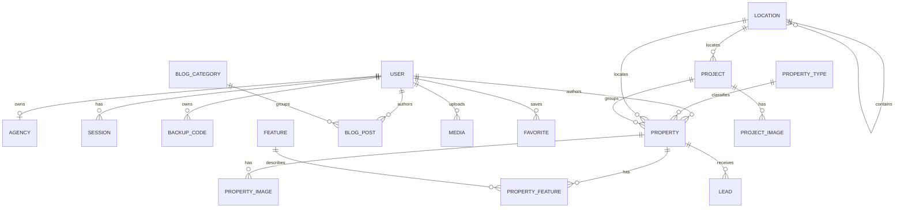

# Məlumat modeli

`prisma/schema.prisma` Cloudflare D1/SQLite üçün 21 model saxlayır. SQLite native enum vermədiyi üçün status, rol, hesab növü və kateqoriya dəyərləri `String` kimi yazılır; icazəli dəyərlərin tətbiq səviyyəli həqiqət mənbəyi `src/lib/constants.ts` faylıdır.

## Domen xəritəsi



## 1. İstifadəçi və autentifikasiya

### `User`

Həm staff, həm ictimai hesabların əsas modelidir.

Əsas ölçülər:

- `role`: yalnız admin icazəsi — `SUPER_ADMIN`, `ADMIN`, `EDITOR`;
- `accountType`: hesab kimdir — `STAFF`, `USER`, `OWNER`, `AGENCY`;
- `passwordHash`, `isActive`, `lastLoginAt`;
- `totpSecret`, `totpEnabledAt`, `mustChangePassword`;
- `failedAttempts`, `lockedUntil`;
- profil üçün `name`, `email`, `phone`.

`role` və `accountType` qəsdən ayrıdır. İctimai hesab sxem məcburiyyətinə görə rol sahəsi daşısa da `accountType !== STAFF` və `authKind !== STAFF_2FA` olduğu üçün admin panelə daxil ola bilmir.

### `Agency`

`accountType = AGENCY` user üçün one-to-one profildir:

- ad və unikal slug;
- description, logo, telefon, ünvan, website;
- `isVerified`, `verifiedAt`;
- user deaktivdirsə və ya agentlik təsdiqlənməyibsə public kataloqda görünmür.

### `Session`

D1-də saxlanan revoke edilə bilən sessiyadır:

- `authKind`: `STAFF_2FA` və ya `PUBLIC`;
- `createdAt`, `expiresAt`, `lastSeenAt`, `revokedAt`;
- IP və user-agent;
- TOTP replay qarşısı üçün `totpCounter`.

Cookie-də session ID və təhlükəsizlik proyeksiyası imzalanmış JWT kimi daşınır. Həqiqi aktivlik hər qorunan server axınında bu modeldən yoxlanılır.

### `BackupCode`

Birdəfəlik 2FA bərpa kodunun SHA-256 hash-i və istifadə vaxtını saxlayır.

### `LoginAttempt`

E-poçt, IP, nəticə, səbəb və vaxt əsasında login auditidir. Səbəblərə uğurlu giriş, səhv parol/TOTP, lockout, rate limit və passiv hesab daxildir.

## 2. Əmlak və taksonomiya

### `PropertyType`

Əmlak növləri: ad, slug, icon, şəkil, sıra və aktivlik. Public və admin formalar aktiv növlərdən seçim edir.

### `Location`

Self-relation olan yerləşmə ağacıdır:

- `CITY`;
- `DISTRICT`;
- `METRO`;
- `SETTLEMENT`;
- `LANDMARK`.

Property city və district-i ayrı relation kimi saxlayır. Public elan forması district/metro/settlement seçiminin seçilən city-yə aid olmasını serverdə yoxlayır.

### `Feature`

Elan xüsusiyyətlərinin mərkəzi kataloqudur. Qruplar:

- `GENERAL`;
- `UTILITY`;
- `PAYMENT`;
- `INDOOR`;
- `OUTDOOR`;
- `SECURITY`.

İpoteka, kredit, faizsiz kredit, hazır ipoteka, barter və taksit `PAYMENT` qrupunda feature kimi də saxlanır.

### `PropertyFeature`

`Property` və `Feature` arasında composite primary key-li many-to-many əlaqədir.

### `Property`

Əsas elan modelidir:

| Qrup | Sahələr |
|---|---|
| Kimlik | `title`, `slug`, `description` |
| Kommersiya | `listingType`, `price`, `currency`, `pricePeriod` |
| Workflow | `status`, `isFeatured`, `isDemo`, `publishedAt`, `deletedAt` |
| Yer | `typeId`, `cityId`, `districtId`, `address`, koordinatlar |
| Ölçü | otaq, yataq, sanitar qovşaq, sahə, torpaq sahəsi, mərtəbə |
| Bazar | təmir, sənəd, tikili növü, ipoteka/taksit |
| Kontent | video, SEO title/description, view count |
| Sahiblik | optional `authorId`, optional `projectId` |

`deletedAt` soft-delete üçündür. Public görünüş `deletedAt: null`, `isDemo: false` və public status tələb edir.

### `PropertyImage`

Sıralanan qalereya item-i: master URL, optional thumbnail, alt mətn, ölçü, sıra və cover flag.

## 3. Layihə və məzmun

### `Project`

Yaşayış/kommersiya/villa/mixed layihəsidir. Status, şəhər, koordinat, tarix, ölçü, mərtəbə/unit sayı, highlight, timeline, cover, aktivlik, demo və soft-delete sahələri var.

### `ProjectImage`

Layihə qalereyasıdır. Şəkillər `EXTERIOR`, `INTERIOR`, `CONSTRUCTION` və `LANDSCAPE` kateqoriyasına bölünür.

### `Service`

Aktivlik və sıra ilə xidmət kontentidir: title, slug, qısa/tam description, icon, image, bullets və SEO sahələri.

### `BlogCategory`

Bloq kateqoriyası, slug və sıralamadır.

### `BlogPost`

Rich-text məqalədir:

- title, slug, excerpt, sanitized content;
- cover və alt mətn;
- optional category və author;
- `DRAFT`, `PUBLISHED`, `ARCHIVED`;
- demo, view count, read minutes, publish və soft-delete vaxtı;
- SEO sahələri.

## 4. CRM və istifadəçi fəaliyyəti

### `Lead`

Müraciətin adı, telefon/e-poçt, mövzu, mesaj, source, status, optional əmlak, assignee və admin note sahələrini saxlayır.

Source dəyərləri:

- `PROPERTY`;
- `CONTACT`;
- `SERVICE`;
- `PROJECT`.

Status axını:

```text
NEW → CONTACTED → IN_PROGRESS → COMPLETED / CLOSED
```

Kod sərt state machine tətbiq etmir; admin icazəli statuslardan istəniləninə keçirə bilər.

### `Favorite`

User və Property arasında persistent favorit modelidir. Hazırkı public favorit UI-si LocalStorage istifadə edir və bu modelə yazmır.

## 5. Media və sistem

### `Media`

R2 obyektinin tətbiq metadata-sıdır:

- master və thumbnail URL;
- original ad yalnız məlumat kimi;
- doğrulanmış MIME, ölçü və image dimensions;
- alt mətn;
- optional uploader;
- yaradılma vaxtı.

Original fayl adı R2 key qurmaq üçün istifadə edilmir.

### `Setting`

Runtime parametrləri üçün `key → value` modelidir. Qəbul edilən key-lər `src/lib/settings.ts` daxilində `SETTING_KEYS` ilə məhdudlaşdırılır.

### `AuditLog`

Admin mutation auditi:

- actor user ID/e-poçt;
- action və entity;
- optional entity ID, summary və IP;
- vaxt.

## Domen sabitləri

### Əmlak statusları

| Dəyər | Public? | Təyinat |
|---|---:|---|
| `DRAFT` | ❌ | Daxili qaralama |
| `PENDING` | ❌ | Public hesabın təsdiq gözləyən elanı |
| `PUBLISHED` | ✅ | Aktiv elan |
| `RESERVED` | ✅ | Beh alınıb |
| `SOLD` | ✅ | Satılıb |
| `RENTED` | ✅ | Kirayə verilib |
| `ARCHIVED` | ❌ | Arxiv |

### Digər sabit qrupları

- `LISTING_TYPES`: `SALE`, `RENT`;
- `PRICE_PERIODS`: `MONTH`, `DAY`;
- `BUILDING_TYPES`: `NEW`, `OLD`;
- `RENOVATIONS`;
- `DOCUMENT_STATUSES`;
- `PROJECT_TYPES`, `PROJECT_STATUSES`, `PROJECT_IMAGE_CATEGORIES`;
- `POST_STATUSES`;
- `LEAD_SOURCES`, `LEAD_STATUSES`;
- `ACCOUNT_TYPES`, `AUTH_KINDS`, `ROLES`, `PERMISSIONS`;
- `CURRENCIES`;
- `FEATURE_GROUPS`, `PAYMENT_OPTIONS`.

Status və label-i komponentdə hardcode etmək olmaz. Dəyər dəsti, Azərbaycan dilində label və badge tone xəritələri birlikdə `constants.ts`-dən gəlməlidir.

## Miqrasiya tarixi

| Fayl | Əsas dəyişiklik |
|---|---|
| `0001_init.sql` | İlkin domen sxemi |
| `0002_auth_and_market_fields.sql` | Auth modelləri və yerli bazar sahələri |
| `0003_audit_log.sql` | Admin audit jurnalı |
| `0004_public_accounts.sql` | Account type, agency və public hesab bazası |
| `0005_session_auth_kind.sql` | Staff/public sessiya ayrımı |

Yeni Prisma sxem dəyişikliyi uyğun nömrəli D1 SQL miqrasiyası olmadan tamamlanmış sayılmır.

## Seed və demo qaydası

- Seed sistem istifadəçisi, taksonomiya, xidmət və digər başlanğıc məlumatları üçündür.
- İctimai property/project/blog demo kontenti yaradılmır.
- Köhnə demo qeydləri `isDemo` ilə public sorğulardan bloklanır.
- `prisma/remove-demo-content.sql` yalnız demo qeydlərini təmizləmək üçündür.
- Remote seed/taksonomiya əmri production məlumatına təsir edə bilər; əvvəl SQL və backup yoxlanmalıdır.
