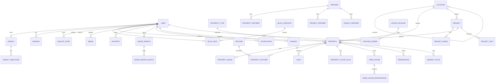

# Məlumat modeli

`prisma/schema.prisma` Cloudflare D1/SQLite üçün 68 model saxlayır (Phase 2 ictimai imkanlar, Bilik Mərkəzi, SERP ekosistemi, sentyabr yol xəritəsinin 4 mərhələsi və #127 ərazi bölgüsü daxil; 29 sentyabr 2026 snapshot-u, son miqrasiya `0053_country_locations_part4.sql`). SQLite native enum vermədiyi üçün status, rol, hesab növü və kateqoriya dəyərləri `String` kimi yazılır; icazəli dəyərlərin tətbiq səviyyəli həqiqət mənbəyi `src/lib/constants.ts` faylıdır.

## Model inventarı

68 model domen üzrə belə qruplaşır:

| Domen | Modellər | Say |
|---|---|---:|
| İstifadəçi və auth | `User`, `Agency`, `AgencyEmployee`, `Session`, `BackupCode`, `Passkey`, `PhoneOtp`, `LoginAttempt`, `EmailVerificationToken`, `PasswordResetToken` | 10 |
| Əmlak və taksonomiya | `PropertyType`, `Location`, `Feature`, `PropertyFeature`, `Property`, `PropertyImage`, `PropertyFloorPlan`, `PropertyPriceHistory`, `NearbyPlace`, `NeighborhoodProfile` | 10 |
| Açıq qapı, rezervasiya, paketlər | `OpenHouse`, `OpenHouseRegistration`, `Reservation`, `ReservationEvent`, `ListingPackage`, `PackageOrder` | 6 |
| Layihə və məzmun | `Project`, `ProjectUnit`, `ProjectImage`, `Service`, `BlogCategory`, `BlogPost`, `Testimonial` | 7 |
| Bilik Mərkəzi | `KnowledgeCategory`, `KnowledgeArticle`, `KnowledgeTerm`, `KnowledgeFaq` | 4 |
| CRM və istifadəçi fəaliyyəti | `Lead`, `Favorite`, `SavedSearch`, `SavedSearchMatch`, `Notification`, `NotificationPreference`, `PushSubscription` | 7 |
| Agent kataloqu | `AgentProfile`, `AgentReview` | 2 |
| Tərəfdaşlıq | `Partner`, `PropertyPartner`, `ProjectPartner`, `AgencyPartner` | 4 |
| SERP ekosistemi | `SeoMetadata`, `SeoLandingPage`, `SeoKeyword`, `EntityProfile`, `SeoAuditIssue`, `SeoSearchMetric`, `SeoAlert`, `Redirect`, `NotFoundHit` | 9 |
| Media, AI, tərcümə | `Media`, `AiContentDraft`, `ContentTranslation` | 3 |
| Sistem, audit, monitorinq | `Setting`, `AuditLog`, `DomainEvent`, `EmailActivity`, `ClientErrorEvent`, `WebVitalMetric` | 6 |

## Domen xəritəsi


```mermaid
erDiagram
    USER ||--o| AGENCY : owns
    AGENCY ||--o{ AGENCY_EMPLOYEE : has
    USER ||--o{ SESSION : has
    USER ||--o{ BACKUP_CODE : owns
    USER ||--o{ PROPERTY : authors
    USER ||--o{ BLOG_POST : authors
    USER ||--o{ MEDIA : uploads
    USER ||--o{ FAVORITE : saves

    PROPERTY_TYPE ||--o{ PROPERTY : classifies
    LOCATION ||--o{ LOCATION : contains
    LOCATION ||--o{ PROPERTY : locates
    LOCATION ||--o{ PROJECT : locates
    PROPERTY ||--o{ PROPERTY_IMAGE : has
    PROPERTY ||--o{ PROPERTY_FEATURE : has
    FEATURE ||--o{ PROPERTY_FEATURE : describes
    PROJECT ||--o{ PROJECT_IMAGE : has
    PROJECT ||--o{ PROPERTY : groups
    BLOG_CATEGORY ||--o{ BLOG_POST : groups
    PROPERTY ||--o{ LEAD : receives
    USER ||--o{ SAVED_SEARCH : owns
    SAVED_SEARCH ||--o{ SAVED_SEARCH_MATCH : finds
    USER ||--o{ NOTIFICATION : receives
    PARTNER ||--o{ PROPERTY_PARTNER : links
    PARTNER ||--o{ PROJECT_PARTNER : links
    PARTNER ||--o{ AGENCY_PARTNER : links
    USER ||--o{ PASSKEY : registers
    USER ||--o{ PACKAGE_ORDER : orders
    LISTING_PACKAGE ||--o{ PACKAGE_ORDER : sells
    PROPERTY ||--o{ PROPERTY_FLOOR_PLAN : has
    PROPERTY ||--o{ OPEN_HOUSE : hosts
    OPEN_HOUSE ||--o{ OPEN_HOUSE_REGISTRATION : receives
    PROPERTY ||--o{ RESERVATION : books
    PROJECT ||--o{ PROJECT_UNIT : contains
    PROPERTY ||--o{ NEARBY_PLACE : near
```

## 1. İstifadəçi və autentifikasiya

### `User`

Həm staff, həm ictimai hesabların əsas modelidir.

Əsas ölçülər:

- `role`: yalnız admin icazəsi — `SUPER_ADMIN`, `ADMIN`, `EDITOR`;
- `accountType`: hesab kimdir — `STAFF`, `USER`, `OWNER`, `AGENT`, `AGENCY`, `CORPORATE`;
- `passwordHash`, `isActive`, `lastLoginAt`;
- `totpSecret`, `totpEnabledAt`, `mustChangePassword`;
- `failedAttempts`, `lockedUntil`;
- public hesab təsdiqi üçün `approvedAt`;
- profil üçün `name`, `firstName`, `lastName`, `email`, `phone`, `avatarUrl`, `locale` və `theme`;
- `birthDate` — istəyə bağlı, yalnız 18 yaş yoxlaması üçün;
- `verifiedPhone` — SMS ilə təsdiqlənmiş, unikal nömrə (telefonla giriş yalnız bununla);
- `googleSub` — Google hesabının bağlantısı;
- `calendarToken` — şəxsi ICS abunəsi (yenidən yaradılanda köhnə link ölür);
- `deletionRequestedAt` — iki mərhələli self-service silinmənin marker-i.

`role` və `accountType` qəsdən ayrıdır. İctimai hesab sxem məcburiyyətinə görə rol sahəsi daşısa da `accountType !== STAFF` və `authKind !== STAFF_2FA` olduğu üçün admin panelə daxil ola bilmir.

### `Agency`

`accountType = AGENCY` user üçün one-to-one profildir:

- ad və unikal slug;
- description, logo, telefon, ünvan, website;
- `isVerified`, `verifiedAt`;
- user deaktivdirsə və ya agentlik təsdiqlənməyibsə public kataloqda görünmür.

### `AgencyEmployee`

Agentlik sahibindən əlavə ən çox 3 komanda üzvünü saxlayır. E-poçt, ad, `MANAGER`/`AGENT` rolu və `PENDING`/`APPROVED`/`REJECTED` təsdiq statusu agentlik kabinetindən idarə olunur.

### `Session`

D1-də saxlanan revoke edilə bilən sessiyadır:

- `authKind`: `STAFF_2FA` və ya `PUBLIC`;
- `createdAt`, `expiresAt`, `lastSeenAt`, `revokedAt`;
- IP və user-agent;
- TOTP replay qarşısı üçün `totpCounter`.

Cookie-də session ID və təhlükəsizlik proyeksiyası imzalanmış JWT kimi daşınır. Həqiqi aktivlik hər qorunan server axınında bu modeldən yoxlanılır.

### `Passkey`, `PhoneOtp`, `EmailVerificationToken`, `PasswordResetToken`

- `Passkey` — admin WebAuthn açarı (TOTP-a alternativ ikinci mərhələ, onu əvəz etmir).
- `PhoneOtp` — HMAC-lə saxlanan birdəfəlik kod: 5 dəqiqə, 5 cəhd, 60 s fasilə, saatda 5 kod.
- `EmailVerificationToken` və `PasswordResetToken` — ictimai hesab bərpa axınları.

### `BackupCode`

Birdəfəlik 2FA bərpa kodunun SHA-256 hash-i və istifadə vaxtını saxlayır.

### `LoginAttempt`

E-poçt, IP, nəticə, səbəb və vaxt əsasında login auditidir. Səbəblərə uğurlu giriş, səhv parol/TOTP, lockout, rate limit və passiv hesab daxildir.

## 2. Əmlak və taksonomiya

### `PropertyType`

Əmlak növləri: ad, slug, icon, şəkil, sıra və aktivlik. Public və admin formalar aktiv növlərdən seçim edir.

### `Location`

Self-relation olan yerləşmə ağacıdır (`id`, `name`, `searchName`, `slug`, `kind`, `parentId`, `order`, `officialCode`). Tam qaydalar, mənbələr və yeniləmə axını ayrıca səhifədədir: [[Ərazi bölgüsü və ünvan|Location-Taxonomy]]. `prisma/locations-data.ts` əl ilə redaktə edilmir, `npm run db:locations:build` ilə üç mənbədən generasiya olunur:

| Giriş faylı | Mənbə | Nə verir |
|---|---|---|
| `prisma/az-admin-divisions.json` | DSK «İnzibati Ərazi Bölgüsü Təsnifatı, 2024» | 11 şəhər, 64 rayon, qəsəbə və kəndlər |
| `prisma/unvanportali-admin-units.json` | Ünvan Reyestri (unvanportali.az) | Bütün 75 şəhər/rayon üzrə rəsmi kodlar və tam qəsəbə/kənd siyahısı |
| `prisma/baku-market-locations.json` | bina.az, kub.az, arenda.az, yeniemlak.az, lalafo.az; ziddiyyətlər OSM ilə | Bakı, Abşeron və Sumqayıt massivləri, metro, nişangah, alternativ yazılışlar (hər qeyddə mənbə kodu) |

Generator Bakının rayon→qəsəbə bölgüsünü reyestrdən götürüb DSK siyahısı ilə çarpaz yoxlayır; ziddiyyətdə (təkrar ad, rəsmi qəsəbə ilə eyniadlı massiv, açarı tapılmayan alias) dayanır. Tam siyahı, mənbələr və ziddiyyətlərin həlli: `docs/erazi/baki-erazi-bolgusu.md` (`npm run db:locations:report`).

| kind | Məna | Say |
|---|---|---|
| `CITY` | 11 respublika tabeli şəhər **və** 64 rayon | 75 |
| `DISTRICT` | Yalnız şəhərdaxili rayon (Bakının 12, Gəncənin 2 rayonu) | 14 |
| `SETTLEMENT` | Rəsmi qəsəbə və rayon tabeli şəhər | 266 |
| `VILLAGE` | Kənd — bütün rayonlarda Ünvan Reyestrinin tam siyahısı | 3 605 |
| `NEIGHBORHOOD` | Massiv/mikrorayon/məhəllə — rəsmi vahid deyil (Bakı 62, Sumqayıt 67, Abşeron 5, Gəncə 2) | 136 |
| `METRO` | Bakı metrosu (Memar Əcəmi-2 daxil); valideyni Bakıdır | 27 |
| `LANDMARK` | Nişangah: ticarət mərkəzi, park, universitet, meydan…; hazırda hamısının valideyni Bakıdır, slug `nisangah-` prefiksli | 214 |
| **Cəmi** | | **4 337** |

Əlavə sahələr:

- `officialCode` — rəsmi 8 rəqəmli kod (Bakı `00000002`, Binəqədi `00100003`, Biləcəri `00102016`). Yalnız rəsmi vahiddə dolu olur; massiv, metro və nişangahda boşdur. Elan formasında rəsmi küçə faylını seçir.
- `searchName` — normallaşdırılmış ad və alternativ yazılışlar ` | ` ilə («müşviqabad | müşfiqabad», «m e resulzade | kirov qesebesi»). Alias ayrıca yer yaratmır.

Qaydalar:

- rəsmi status yalnız DSK/Ünvan Reyestrindən gəlir; elan saytlarının «qəs.» yazması qəsəbə statusu vermir — belə adlar `NEIGHBORHOOD`-dur;
- Bakıda rəsmi kənd yoxdur; Nərimanov, Nəsimi və Yasamalda rəsmi qəsəbə yoxdur;
- düzəldilmiş valideynlər (`migrations/0050`): 8-ci kilometr → Nizami, Günəşli → Suraxanı, 6–9-cu mikrorayon → Binəqədi, Sovetski → Yasamal, Alatava → 1-ci (Nəsimi) və 2-ci (Yasamal);
- rayon `CITY` səviyyəsindədir; Xırdalan, Novxanı, Masazır, Görədil Abşeron rayonunun altındadır (`migrations/0031`);
- slug valideynin slug-ı ilə prefikslənir (`quba-xinaliq`), Bakı ağacında `baki-<ad>`;
- ağac iki dərinlikdədir, şəhərə aidlik `locationBelongsToCity()` ilə yoxlanılır;
- `METRO` və `LANDMARK` `LOCATION_CHILD_KINDS`-ə salınmır — öz sahələri var;
- siyahılar `compareAzerbaijani()` (`lib/az-collation.ts`) və generatorun `az_key` sırası ilə düzülür — SQLite binar sırası «Ç», «Ə», «Ş»-ni sona atır;
- ~3 600 kənd heç vaxt bir yerdə client-ə getmir: filtrdə yalnız ictimai elanı olan kəndlər (`villagesWithListings()`), formada seçilmiş rayonun kəndləri (`/api/yerler/kendler?seher=<id>`), redaktədə elanın öz kəndi (`getPropertyFormOptions({ propertyId })`);
- ~700 sətirlik ağac D1-in 100 parametr həddinə görə düz sorğu + JS ağacı (`location-tree.ts`) ilə qurulur.

Property `cityId` və `districtId` (ən dərin seçim), `metroId` və `landmarkId` (nişangah) saxlayır; siyahıda olmayan massiv `neighborhoodName`, küçə və bina `street`/`building`-dədir. Nişangah yalnız `LANDMARK` növündə və seçilmiş şəhərin uşağı ola bilər (`landmarkBelongsToCity()`). Rəsmi küçələr bazada deyil — `public/data/kuceler/<officialCode>.json` statik fayllarıdır (`npm run db:streets:build`) və formada təklif kimi göstərilir. Region pilləsi (14 iqtisadi rayon, Naxçıvan MR) bazada deyil, `lib/regions.ts`-dədir.

### `Feature`

Elan xüsusiyyətlərinin mərkəzi kataloqudur. Qruplar:

- `GENERAL`;
- `UTILITY`;
- `PAYMENT`;
- `INDOOR`;
- `OUTDOOR`;
- `SECURITY`.

İpoteka, kredit, faizsiz kredit, hazır ipoteka, barter və taksit `PAYMENT` qrupunda feature kimi də saxlanır.

### `PropertyFeature`

`Property` və `Feature` arasında composite primary key-li many-to-many əlaqədir.

### `Property`

Əsas elan modelidir:

| Qrup | Sahələr |
|---|---|
| Kimlik | `title`, `slug`, `description` |
| Kommersiya | `listingType`, `price`, `currency`, `pricePeriod` |
| Workflow | `status`, `isFeatured`, `isDemo`, `publishedAt`, `deletedAt` |
| Yer | `typeId`, `cityId`, `districtId`, `address`, koordinatlar |
| Ölçü | otaq, yataq, sanitar qovşaq, sahə, torpaq sahəsi, mərtəbə |
| Bazar | təmir, sənəd, tikili növü, ipoteka/taksit |
| Kontent | video, `virtualTourUrl`, SEO title/description, `metaKeywords`, `socialText`, `seoGeneratedAt`, view count |
| Axtarış | `searchText` (normallaşdırılmış), `vectorIndexedAt` |
| Ünvan | `street`, `building`, `neighborhoodName` |
| Müddət | `listingExpiresAt`, `expiryReminderSentAt`, `expiredAt` |
| İdxal | `importKey` (məzmun heşi), `importCompletedAt` |
| Saxlama | `closedAt`, `retentionUntil`, `contentFingerprint` |
| Sahiblik | optional `authorId`, optional `projectId` |

`deletedAt` soft-delete üçündür. Public görünüş `publicPropertyWhere()`-dən keçir: `deletedAt: null`, public status və `demoWhere()` (demo rejim bağlı olanda `isDemo: false`). Sitemap/SEO üçün `indexablePropertyWhere()` həmişə `isDemo: false` daşıyır.

### `PropertyFloorPlan`, `OpenHouse`, `OpenHouseRegistration`, `NearbyPlace`, `PropertyPriceHistory`

- `PropertyFloorPlan` — qalereyadan ayrı plan şəkilləri; kart/qalereya sorğularına düşmür.
- `OpenHouse` + `OpenHouseRegistration` — açıq qapı günü, tutum və qeydiyyat (qeydiyyat lead yaradır).
- `NearbyPlace` — ən yaxın metro və digər obyektlər (metro koordinatı kodda saxlanmır).
- `PropertyPriceHistory` — qiymət dəyişikliyi və endirim bildirişləri üçün.

### `ListingPackage`, `PackageOrder`

Premium paketlər və ödəniş uçotu. Məbləğ qəpiklə (`*Minor`, tam ədəd); paketin adı/müddəti/qiyməti sifarişə kopyalanır. Status keçidləri şərti `updateMany` ilədir — ikinci təsdiq premiumu təkrar uzatmır. Real ödəniş provayderi yoxdur.

### `PropertyImage`

Sıralanan qalereya item-i: master URL, optional thumbnail, alt mətn, ölçü, sıra və cover flag.

## 3. Layihə və məzmun

### `Project`

Yaşayış/kommersiya/villa/mixed layihəsidir. Status, şəhər, koordinat, tarix, ölçü, mərtəbə/unit sayı, highlight, timeline, cover, aktivlik, demo və soft-delete sahələri var.

### `ProjectUnit`

Mənzil şahmatı: blok, mərtəbə, nömrə və status. Admin generatoru mövcud blok + nömrəni üzərinə yazmır.

### `ProjectImage`

Layihə qalereyasıdır. Şəkillər `EXTERIOR`, `INTERIOR`, `CONSTRUCTION` və `LANDSCAPE` kateqoriyasına bölünür.

### `Service`

Aktivlik və sıra ilə xidmət kontentidir: title, slug, qısa/tam description, icon, image, bullets və SEO sahələri.

### `BlogCategory`

Bloq kateqoriyası, slug və sıralamadır.

### `BlogPost`

Rich-text məqalədir:

- title, slug, excerpt, sanitized content;
- cover və alt mətn;
- optional category və author;
- `DRAFT`, `PUBLISHED`, `ARCHIVED`;
- demo, view count, read minutes, publish və soft-delete vaxtı;
- SEO sahələri.

### Bilik Mərkəzi modelləri

Public sorğular `src/lib/knowledge.ts`, admin yazmaları `src/app/admin/bilik-merkezi/actions.ts` üzərindən gedir. Public sorğu yalnız dərc olunmuş və `deletedAt: null` məzmunu qaytarır.

| Model | Əsas sahələr | Qeyd |
|---|---|---|
| `KnowledgeCategory` | `slug`, `name`, `searchName`, `icon`, `order`, `isActive` | Məqalə və terminlərin kateqoriyası |
| `KnowledgeArticle` | `title`, `excerpt`, sanitizasiya olunmuş `content`, `audience`, `level`, `status` | Hüquqi bələdçi məqaləsi |
| ↳ hüquqi provenance | `legalStatus`, `riskLevel`, `jurisdiction`, `legalReviewedAt`, `legalActs`, `sourceUrls`, `legalBasis` | Redaksiya izi üçün saxlanmalıdır |
| ↳ strukturlaşdırılmış blok | `requiredDocuments`, `procedure`, `duration`, `costs`, `risks`, `checklist`, `template`, `courtPosition` | Detal səhifəsində ayrıca bloklar |
| ↳ redaksiya və SEO | `reviewerName`, `reviewedAt`, `reviewAfter`, `tags`, `related*Ids`, `metaTitle`, `metaDescription`, `noIndex`, `canonicalUrl`, `og*`, `isDemo` | — |
| `KnowledgeTerm` | `term`, `searchName`, `shortDefinition`, `definition`, `initial`, `relatedSlugs`, `status` | `/lugat` + `DefinedTerm` JSON-LD |
| `KnowledgeFaq` | `question`, `answer`, `category`, `status`, `order` | `/bilik-merkezi/suallar` (sayt FAQ-ı `/suallar` isə `src/i18n/site-faq.ts`-dədir) |

HTML həm əsas məzmunda, həm tərcümədə yazılarkən sanitizasiya olunur. `prisma/build-knowledge-hub-sql.ts` hüquqi mənbə sənədindən yalnız **DRAFT** qeydlər yaradır.

### SERP ekosistemi modelləri

| Model | Əsas sahələr | Təyinat |
|---|---|---|
| `SeoMetadata` | `entityType`, `entityId`, `locale`, `title`, `description`, `canonical`, `robotsIndex`, `robotsFollow`, `og*` | Entity + locale üzrə idarə olunan metadata (redaktor dəyəri generatordan üstündür) |
| `SeoLandingPage` | `locale`, `slug`, `h1`, `introContent`, `bottomContent`, `filtersJson`, `faqJson`, `indexable`, `indexEmpty`, `minInventory`, `status` | `/[seoLanding]` runtime-ı; indeksləmə `landingCanBeIndexed()`: `indexable`, ən azı 80 sözlük unikal `introContent`, elan sayı ≥ `minInventory` (boş nəticə yalnız `indexEmpty` ilə) |
| `SeoKeyword` | `keyword`, `locale`, `intent`, `cluster`, `targetUrl`, `priority`, `searchVolume`, `currentPosition` | Açar söz planı |
| `EntityProfile` | `entityType`, `entityId`, `schemaType`, `legalName`, `dataJson`, `isPublic` | Struktur data üçün entity profili |
| `SeoAuditIssue` | `type`, `severity`, `url`, `message`, `status`, `detectedAt`, `resolvedAt` | Avtomatik audit tapıntıları |
| `SeoSearchMetric` | `date`, `query`, `page`, `country`, `device`, `clicks`, `impressions`, `ctr`, `position` | Search Console metrikləri |
| `SeoAlert` | `type`, `severity`, `message`, `status` | Monitorinq xəbərdarlığı (`msg()` markeri `translateServerMessage()` ilə göstərilir) |

## 4. CRM və istifadəçi fəaliyyəti

### `Lead`

Müraciətin adı, telefon/e-poçt, mövzu, mesaj, source, status, optional əmlak, assignee və admin note sahələrini saxlayır.

Source dəyərləri:

- `PROPERTY`;
- `CONTACT`;
- `SERVICE`;
- `PROJECT`;
- `OWNER` — `/emlakimi-sat` və qiymətləndirmə müraciəti.

Status axını:

```text
NEW → CONTACTED → IN_PROGRESS → COMPLETED / CLOSED
```

Kod sərt state machine tətbiq etmir; admin icazəli statuslardan istəniləninə keçirə bilər.

### `Favorite`

User və Property arasında persistent favorit modelidir. Favorit əvvəl LocalStorage-də saxlanılır və hesabla daxil olanda `/api/hesab/favoritler` ilə bu modelə sinxronlaşır.

### Phase 2 modelləri

- `Reservation`, `ReservationEvent` — rezervasiya axını və təqvim;
- `AgentProfile`, `AgentReview`, `Testimonial` — agent kataloqu və moderasiyadan keçən rəylər;
- `PushSubscription`, `NotificationPreference` — Web Push, kanallar, sakit saatlar;
- `NeighborhoodProfile` — rayon profili (satışda qiymət göstəricisinin son ehtiyatı);
- `AiContentDraft` — AI köməkçinin qaralamaları;
- `ContentTranslation`, `ClientErrorEvent`, `WebVitalMetric` — tərcümə və monitorinq.

### `SavedSearch`, `SavedSearchMatch`, `Notification`

- `SavedSearch` istifadəçinin adlandırdığı filtr JSON-unu, `IMMEDIATE`/`DAILY`/`WEEKLY`/`OFF` tezliyini və son yoxlama/bildiriş vaxtını saxlayır.
- `SavedSearchMatch` eyni əmlakın eyni axtarış üçün təkrar bildirişini bloklayır.
- `Notification` kabinet bildirişinin başlığını, məzmununu, action URL-ni və `readAt` vəziyyətini saxlayır.

## 5. Media və sistem

### `Media`

R2 obyektinin tətbiq metadata-sıdır (`checksum` və `watermarkApplied` təkrar su nişanının qarşısını alır, `clientUploadId` toplu yükləmədə təkrarı bloklayır):

- master və thumbnail URL;
- original ad yalnız məlumat kimi;
- doğrulanmış MIME, ölçü və image dimensions;
- alt mətn;
- optional uploader;
- yaradılma vaxtı.

Original fayl adı R2 key qurmaq üçün istifadə edilmir.

### `Setting`

Runtime parametrləri üçün `key → value` modelidir. Qəbul edilən key-lər `src/lib/settings.ts` daxilində `SETTING_KEYS` ilə məhdudlaşdırılır.

### `AuditLog`

Admin mutation auditi:

- actor user ID/e-poçt;
- action və entity;
- optional entity ID, summary və IP;
- vaxt.

Audit qeydləri cədvəlli admin görünüşündə səhifələnir. Tam sıfırlama yalnız Super Admin üçündür və sıfırlamanın özü yeni audit qeydi yaradır.

### `EmailActivity`

Korporativ məktubun məzmununu deyil, Resend provider ID-si, istiqamət, event, göndərən/alıcı ünvanları, mövzu, message ID, attachment sayı və son hadisə vaxtını saxlayır. `providerId` unikaldır və webhook event-ləri upsert olunur.

### `DomainEvent`

Kritik yazılardan sonra yaranan yüngül outbox qeydidir: event type, entity type/ID və optional JSON payload. `AuditLog` actor izidir; `DomainEvent` isə sistemdə baş verən hadisəni ifadə edir.

### `Redirect`, `NotFoundHit`

- `Redirect` aktiv 301/302 köhnə-yeni URL müqaviləsini və hit sayını saxlayır.
- `NotFoundHit` yönləndirilməyən yolun ilk/son görünmə vaxtını, referrer və sayını toplayır.

## 6. Rəsmi tərəfdaşlıq

### `Partner`

İstifadəçi hesabı tələb etməyən xarici biznes tərəfdaşıdır. `Agency` ilə qarışdırılmamalıdır. Əsas qruplar:

- AZ/EN/RU qısa və tam təsvir, hüquqi disclaimer;
- sayt, e-poçt, telefon, WhatsApp və ünvan;
- əsas/açıq/tünd loqo və cover;
- partnership type, status, verified/rəsmi/featured/public/homepage görünürlüyü;
- yalnız təsdiqlənmiş `officialSince` və bitmə tarixi;
- SEO və OG;
- yalnız `partner:contract` icazəsi ilə müqavilə metadata-sı;
- soft-delete və created/updated/deleted actor-ları.

Public profil yalnız `ACTIVE + verified + officialPartner + showPublicly + deletedAt:null` olduqda görünür.

### `PropertyPartner`, `ProjectPartner`, `AgencyPartner`

Tərəfdaşı elan, layihə və agentliklə çox-çox əlaqələndirir. Əlaqədə rol və public görünürlük saxlanılır; elan/layihə üçün source URL və əsas tərəfdaş flag-i də var. Bir entity eyni tərəfdaşla müxtəlif rollarda əlaqələnə bilər.

## Domen sabitləri

### Əmlak statusları

| Dəyər | Public? | Təyinat |
|---|---:|---|
| `DRAFT` | ❌ | Daxili qaralama |
| `PENDING` | ❌ | Public hesabın təsdiq gözləyən elanı |
| `PUBLISHED` | ✅ | Aktiv elan |
| `RESERVED` | ✅ | Beh alınıb |
| `SOLD` | ✅ | Satılıb |
| `RENTED` | ✅ | Kirayə verilib |
| `ARCHIVED` | ❌ | Arxiv |

### Digər sabit qrupları

- `LISTING_TYPES`: `SALE`, `RENT`;
- `PRICE_PERIODS`: `MONTH`, `DAY`;
- `BUILDING_TYPES`: `NEW`, `OLD`;
- `RENOVATIONS`;
- `DOCUMENT_STATUSES`;
- `PROJECT_TYPES`, `PROJECT_STATUSES`, `PROJECT_IMAGE_CATEGORIES`;
- `POST_STATUSES`;
- `LEAD_SOURCES`, `LEAD_STATUSES`;
- `ACCOUNT_TYPES`, `AUTH_KINDS`, `ROLES`, `PERMISSIONS`;
- `CURRENCIES`;
- `FEATURE_GROUPS`, `PAYMENT_OPTIONS`.

Status və label-i komponentdə hardcode etmək olmaz. Dəyər dəsti, Azərbaycan dilində label və badge tone xəritələri birlikdə `constants.ts`-dən gəlməlidir.

## Miqrasiya tarixi

| Fayl | Əsas dəyişiklik |
|---|---|
| `0001_init.sql` | İlkin domen sxemi |
| `0002_auth_and_market_fields.sql` | Auth modelləri və yerli bazar sahələri |
| `0003_audit_log.sql` | Admin audit jurnalı |
| `0004_public_accounts.sql` | Account type, agency və public hesab bazası |
| `0005_session_auth_kind.sql` | Staff/public sessiya ayrımı |
| `0006_seo_fields.sql`–`0010_property_metro.sql` | SEO, redirect, Phase 1 bazası, moderasiya və metro |
| `0011_normalize_service_timestamps.sql` | Köhnə service timestamp backfill-i |
| `0012_saved_search_notifications.sql` | Saxlanmış axtarış, bildiriş, komanda və domen hadisəsi |
| `0013_partners.sql` | Tərəfdaşlıq sistemi və əlaqə modelləri |
| `0014_partner_audit_snapshots.sql` | Audit old/new snapshot-ları |
| `0015_open_next_tag_cache.sql` | OpenNext `revalidations` cədvəli |
| `0015_public_account_approval.sql` | İctimai hesab `approvedAt` təsdiqi |
| `0016_staff_profile_avatar.sql` | Staff avatar/profil sahələri |
| `0017_project_partner_source.sql` | Layihə tərəfdaş mənbə URL-si |
| `0018_email_activity.sql` | Korporativ e-poçt metadata jurnalı |
| `0019_normalize_d1_datetime_storage.sql` | Service/Setting DateTime-larını vahid ISO mətnə çevirir |
| `0020_account_recovery_tokens.sql` | E-poçt təsdiqi və parol bərpası tokenləri |
| `0021_azerbaijani_search_normalization.sql` | `searchText` / `searchName` normallaşdırılmış sütunları |
| `0022_monitoring_and_content_translations.sql` | Client xətaları, Web Vitals, məzmun tərcümələri |
| `0023_public_platform_phase2.sql` | Push, bildiriş seçimləri, agent profili/rəylər, rezervasiya və s. |
| `0024_knowledge_hub.sql` | Bilik Mərkəzi modelləri |
| `0025_serp_ecosystem.sql` | SERP modelləri, elan saxlama sahələri |
| `0026_normalize_theme_preference.sql` | Tema seçiminin normallaşdırılması |
| `0027_demo_content_flags.sql` | Agentlik/agent/tərəfdaşa `isDemo` |
| `0028_account_deletion_queue.sql` | `User.deletionRequestedAt` |
| `0029_disable_maintenance_mode.sql` | Sistemi normal rejimə qaytarır |
| `0030_service_seo_content.sql` | Xidmət SEO məzmunu |
| `0031_official_location_tree.sql` | Rəsmi inzibati-ərazi ağacı |
| `0032_media_client_upload_id.sql` | Toplu yükləmə idempotentliyi |
| `0033_partner_iso_dates.sql` | Tərəfdaş tarixlərinin ISO formatı |
| `0034_property_import_key.sql` | CSV idxal marker-ləri |
| `0035_property_floor_plans.sql` | Plan və 360° tur |
| `0036_project_units.sql` | Mənzil şahmatı |
| `0037_property_vector_indexed.sql` | Semantik indeks vaxtı |
| `0038_office_address_45a.sql` | Ofis ünvanı: Əliyar Əliyev 45a, AZ1005 |
| `0039_listing_expiry.sql` | Elan müddəti sahələri |
| `0040_open_houses.sql` | Açıq qapı günləri |
| `0041_user_calendar_token.sql` | ICS təqvim tokeni |
| `0042_listing_packages.sql` | Premium paketlər və sifarişlər |
| `0043_passkeys.sql` | Admin passkey |
| `0044_user_google_sub.sql` | Google ilə giriş bağlantısı |
| `0045_phone_otp.sql` | Telefonla OTP girişi |
| `0046_property_address_parts.sql` | Küçə, bina, massiv adı |
| `0047_property_seo_automation.sql` | Avtomatik SEO sahələri |
| `0048_account_profiles.sql` | Ad, soyad, doğum tarixi və profil sahələri |
| `0049_restore_treva_media.sql` | TREVA tərəfdaşının kənar loqo/örtüyünün bərpası |
| `0050_baku_location_details.sql` | `Location.officialCode`, `Property.landmarkId`; yerləşmə sətirlərinin 1-ci hissəsi |
| `0051`–`0053_country_locations_part2..4.sql` | Ölkə üzrə qəsəbə/kənd (~3 600 kənd), Sumqayıt massivləri, metro, 214 nişangah, alias-lı `searchName`; sonda köhnə «Alatava» → «2-ci Alatava». ~8 000 ifadə ~500 KB-lıq ardıcıl hissələrdə, idempotent |

Miqrasiyalar `main` push-unda CI tərəfindən **bundle-dan əvvəl** tətbiq olunur. Yeni miqrasiya: `npm run db:migrate:new -- --output migrations/000N_ad.sql` (əvvəlcə `npm run db:migrate:local`).

Yeni Prisma sxem dəyişikliyi uyğun nömrəli D1 SQL miqrasiyası olmadan tamamlanmış sayılmır.

## Seed və demo qaydası

- Seed sistem istifadəçisi, taksonomiya, xidmət və digər başlanğıc məlumatları üçündür; **giriş edilə bilən hesab yaratmır** (`SEED_ADMIN_PASSWORD` yoxdursa `passwordHash = "disabled"`, `isActive = 0`). Real hesab `npm run auth:create-admin` ilə qurulur.
- `Property`, `Project`, `BlogPost`, `Agency`, `AgentProfile` və `Partner` modellərində `isDemo` var. Görünürlük `/admin/demo-mezmun` açarı (`demo.content_enabled`) ilə idarə olunur; açar yazılmayıbsa staging-də açıq, production-da bağlıdır.
- **Qeydlərin `isDemo` bayrağı heç vaxt dəyişmir** — görünürlük yalnız sorğu şərtindədir (`demoWhere()`).
- Nümunə dəsti: 15 kateqoriyanın hər biri üçün 20 elan, 12 kompleks, 6 agentlik, 12 agent, 12 tərəfdaş, 20 bloq (`npm run db:demo:build` → `prisma/demo-content.sql`). Yalnız staging-ə yüklənir.
- `prisma/remove-demo-content.sql` bütün `isDemo` qeydlərini silir və açarı söndürür.
- Remote seed/taksonomiya əmri production məlumatına təsir edə bilər; əvvəl SQL və backup yoxlanmalıdır.
- D1-də eyni DateTime sütununda integer və mətn storage class qarışdırılmamalıdır. Seed generatoru `Service` və `Setting` tarixlərini ISO-8601 mətnə normallaşdırır.
