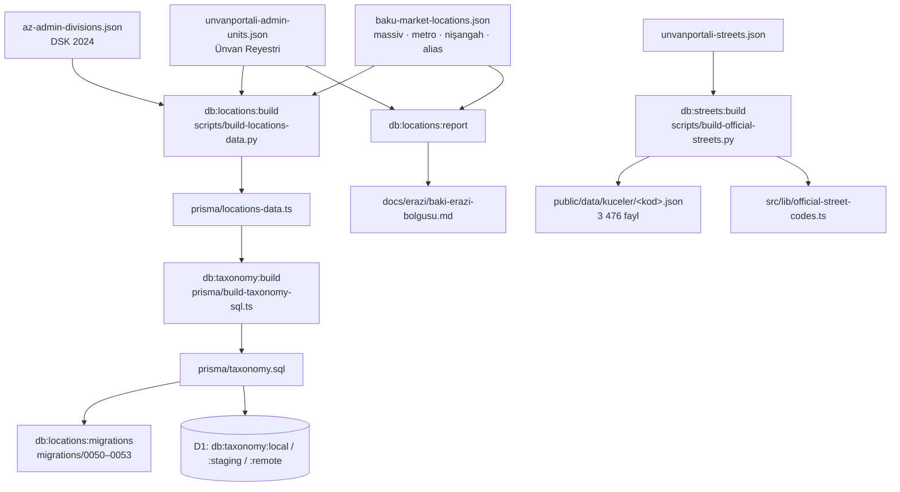

# Ərazi bölgüsü və ünvan

Bu səhifə elanın «harada» olduğunu təsvir edən bütün qatları izah edir: rəsmi inzibati-ərazi ağacı, bazarda işlənən massivlər, metro, nişangahlar, rəsmi küçələr, onların mənbələri, saytda harada işləndiyi və datanın necə yeniləndiyi. Vəziyyət: 29 sentyabr 2026 (#127 / PR #128).

> **Qısa qayda:** rəsmi status yalnız Dövlət Statistika Komitəsinin (DSK) təsnifatından və Ünvan Reyestrindən gəlir. Elan saytlarının «qəs.» yazması qəsəbə statusu yaratmır — belə adlar massivdir (`NEIGHBORHOOD`).

## Səviyyələr

`Location.kind` dəyərləri `src/lib/constants.ts` → `LOCATION_KINDS`-dədir.

| kind | Məna | Rəsmi kod | Valideyn | Say |
|---|---|:---:|---|---:|
| `CITY` | 11 respublika tabeli şəhər **və** 64 rayon — istifadəçinin birinci seçimi | ✅ | yoxdur | 75 |
| `DISTRICT` | Yalnız şəhərdaxili inzibati rayon: Bakının 12, Gəncənin 2 rayonu | ✅ | şəhər | 14 |
| `SETTLEMENT` | Rəsmi qəsəbə və rayon tabeli şəhər (Xırdalan, Xudat, Horadiz, Liman…) | ✅ | rayon və ya şəhər rayonu | 266 |
| `VILLAGE` | Kənd — bütün rayonlarda Ünvan Reyestrinin tam siyahısı; Bakıda kənd yoxdur | ✅ | rayon (`CITY`) | 3 605 |
| `NEIGHBORHOOD` | Massiv, mikrorayon, məhəllə — rəsmi vahid deyil | — | şəhər rayonu və ya şəhər | 136 |
| `METRO` | Bakı metrosunun stansiyası (Memar Əcəmi-2 daxil) | — | Bakı | 27 |
| `LANDMARK` | Nişangah: ticarət mərkəzi, park, universitet, meydan, bazar… | — | Bakı | 214 |
| | | | **Cəmi** | **4 337** |

Massivlərin bölgüsü: Bakı 62, Sumqayıt 67 (iki mənbədə təsdiqlənən 17 mikrorayon, 40 məhəllə, 10 ərazi), Abşeron 5 (Nübar, Atyalı və s.), Gəncə 2 (Yeni Gəncə, Gülüstan).

**Rayon `CITY` səviyyəsindədir, `DISTRICT` deyil.** Quba ilə Bakı axtarışda eyni açılan siyahıdan seçilir; `DISTRICT` yalnız şəhərin daxilindəki rayon deməkdir. Xırdalan, Novxanı, Masazır, Görədil Abşeron rayonunun altındadır — nə Bakının rayonu, nə ayrıca şəhər (`migrations/0031`).

Region pilləsi (14 iqtisadi rayon + Naxçıvan MR) bazada deyil, `src/lib/regions.ts`-dədir: `regionForCitySlug()`, `regionLabel()`.

## Sahələr

| Sahə | Nədir | Nümunə |
|---|---|---|
| `slug` | Valideynin slug-ı ilə prefikslənir; Bakı ağacında konvensiya `baki-<ad>`, nişangahda `nisangah-<ad>` | `quba-xinaliq`, `abseron-xirdalan`, `baki-nesimi`, `nisangah-28-mall` |
| `officialCode` | DSK / Ünvan Reyestrinin 8 rəqəmli kodu; yalnız rəsmi vahiddə dolu | Bakı `00000002`, Binəqədi `00100003`, Biləcəri `00102016` |
| `searchName` | Normallaşdırılmış ad + alternativ yazılışlar, ` \| ` ilə | `müşviqabad \| müşfiqabad`, `m e resulzade \| kirov qesebesi` |
| `order` | Azərbaycan əlifbası sırası (generatorun `az_key`-i) | — |

Elanda (`Property`):

- `cityId` — şəhər/rayon;
- `districtId` — **ən dərin seçim** (şəhər rayonu, qəsəbə, kənd və ya massiv — hamısı bu sütunda);
- `metroId`, `landmarkId` — ayrıca sahələr;
- `neighborhoodName` — siyahıda olmayan massivin sərbəst adı;
- `street`, `building` — sərbəst mətn; `address` onlardan qurulur (CSV idxalında sərbəst qalır).

## Mənbələr

| Mənbə | Nə verir | Snapshot |
|---|---|---|
| [DSK — İnzibati Ərazi Bölgüsü Təsnifatı, 2024](https://e-qanun.az/framework/57325) (16.02.2024, 2/2 nömrəli qərar) | 11 şəhər, 64 rayon, 12 şəhər rayonu, qəsəbə və kəndlər | `prisma/az-admin-divisions.json` |
| Ünvan Portalı (unvanportali.az) — `api/adminUnits/list?parentId=<kod>` | Bütün 75 şəhər/rayon üzrə rəsmi ağac və kodlar | `prisma/unvanportali-admin-units.json` |
| Ünvan Portalı — `api/throughFares/<vahid>` | ~63 000 rəsmi küçə, prospekt, döngə, meydan, şose | `prisma/unvanportali-streets.json` |
| bina.az, kub.az, arenda.az, yeniemlak.az, lalafo.az | Massivlər, metro, nişangahlar, alternativ yazılışlar | `docs/erazi/sources/*.json` |
| tap.az (elan başlıqları), emlak.az (axtarış indeksi), evimemlak.az (Naxçıvan MR) | Yoxlama: tapılan adların hamısı ağacda var | `docs/erazi/sources/` |
| OpenStreetMap / Nominatim | Ziddiyyətli rayon sərhədlərinin yoxlanması | — |

Hər massiv, metro və nişangah qeydi `prisma/baku-market-locations.json`-da mənbə kodları daşıyır. Mənbələr arasındakı ziddiyyətlər və verilən qərarlar (8-ci kilometr → Nizami, Günəşli → Suraxanı, 6–9-cu mikrorayon → Binəqədi, Sovetski → Yasamal, 1-ci Alatava → Nəsimi / 2-ci Alatava → Yasamal, Şuşa şəhərciyi → Sabunçu, Qurd qapısı əlavə edilmədi və s.) generasiya olunan hesabatdadır: [`docs/erazi/baki-erazi-bolgusu.md`](https://github.com/MuradoffTehmez/LuxeHome/blob/main/docs/erazi/baki-erazi-bolgusu.md).

## Generasiya axını

`prisma/locations-data.ts`, `prisma/taxonomy.sql`, `public/data/kuceler/`, `src/lib/official-street-codes.ts`, hesabat və `migrations/0050`–`0053` **əl ilə redaktə edilmir**.

Generator Bakının rayon → qəsəbə bölgüsünü reyestrdən götürüb DSK siyahısı ilə çarpaz yoxlayır və bu hallarda **dayanır** (səssizcə atmaq valideyn əlaqəsini korlayardı):

- təkrar slug;
- rəsmi qəsəbə ilə eyniadlı massiv;
- açarı tapılmayan alias;
- DSK ilə reyestr arasında uyğunsuz rayon bölgüsü.

Şəhər/rayonla eyniadlı qəsəbə ayrıca qeyd yaratmır: «Binəqədi qəsəbəsi» Binəqədi rayonunun mərkəzidir və siyahıda iki dəfə görünməməlidir. DSK və reyestr yazılışı fərqli olanda (köhnə adlar) mövcud elanların slug-ı qorunsun deyə DSK yazılışı saxlanılır, reyestr kodu normallaşdırılmış açarla bağlanır.

## Saytda istifadə

### İctimai filtr (`/emlaklar`)

- Filtr ağacı `getFilterOptions()` ilə qurulur; ~700 sətirlik ağac D1-in 100 bound parametr həddinə görə nested relation ilə deyil, düz sorğu + JS ağacı (`location-tree.ts`, `buildCityFilterTree()`) ilə yığılır.
- Rayon açılışında seçilə bilən səviyyələr `LOCATION_CHILD_KINDS`-dədir. `METRO` və `LANDMARK` oraya **salınmır** — öz filtr sahələri var (`?metro=`, `?nisangah=`); salınsa rayon açılışında 26 stansiya görünərdi.
- Kəndlərdən filtrə yalnız ictimai elanı olanlar düşür (`villagesWithListings()`).
- `?axtaris=` mətn axtarışı elanın yerini, metrosunu, nişangahını, massivin rayonunu və `searchName`-dəki alias-ları tapır («Müşfiqabad», «8 km», «Kirov qəsəbəsi»).
- `?nisangah=` desktop panel, mobil sheet, aktiv çip, boş nəticə təklifi (`CHIP_FIELDS`) və SEO indeks siyahısında işləyir.

### Landing səhifələri

- `/rayon/<slug>` `DISTRICT`-lə yanaşı qəsəbə, kənd və massivi də açır (hamısı `Property.districtId`-dədir). Səhifə etiketi `kind`-dən qurulur (`placeLabelAz()`) — «Maştağa rayonunda» yazılmır.
- `/metro/<slug>` — metro landing-i.
- Sitemap üçün `getIndexableTaxonomyLandings("DISTRICT")` eyni səviyyə dəstini işlədir.

### Elan forması (`LocationFields`, admin + kabinet)

Pillələr: Region → şəhər/rayon → şəhər rayonu → qəsəbə → kənd → massiv → metro → nişangah → küçə → bina.

- **Kənd** sahəsi rayon seçiləndə `/api/yerler/kendler?seher=<id>`-dən yüklənir (cavab CDN-də 1 gün keşlənir). ~3 600 kənd heç vaxt bir yerdə client-ə getmir; redaktə olunan elanın öz kəndi `getPropertyFormOptions({ propertyId })` ilə gəlir.
- **Metro və nişangah** şəhərə bağlıdır; şəhər dəyişəndə sıfırlanır. Kabinetdə metro sahəsi #128 ilə ilk dəfə açıldı.
- **Küçə** sahəsi sərbəst mətndir, rəsmi siyahı yalnız təklifdir: forma seçimdən yuxarı qalxıb `OFFICIAL_STREET_CODES`-də olan ilk vahidin (qəsəbə/kənd → şəhər rayonu → şəhər) `/data/kuceler/<kod>.json` faylını yükləyir. Kodu siyahıda olmayan vahid üçün sorğu göndərilmir (404-ün qarşısı).
- Server validasiyası: `locationBelongsToCity()` iki dərinlikli ağacda şəhərə aidliyi yoxlayır (yalnız `parentId`-yə baxmaq Maştağanı səhvən rədd edərdi); `landmarkBelongsToCity()` nişangahın `LANDMARK` növündə və seçilmiş şəhərin uşağı olmasını tələb edir.

### Göstərmə

- Tam ünvan: `formatFullAddress()` (`src/lib/location-path.ts`); kartda `shortLocation()` («Əliabad qəsəbəsi, Naxçıvan»).
- Sıralama həmişə `compareAzerbaijani()` / `byAzerbaijaniName` (`src/lib/az-collation.ts`) ilə: `localeCompare(…, "az")` workerd-də etibarsızdır (ICU-da `az` collation-u tam deyil), SQLite-in binar `ORDER BY`-ı isə «Ç», «Ə», «Ş» ilə başlayanları sona atır.

### Digər istifadə yerləri

- Yadda saxlanmış axtarış nişangah filtrini saxlayır.
- CSV idxalında `metro` və `landmark` sütunları şəhərin öz stansiya/nişangahları arasında slug və ya diakritiksiz adla axtarılır.
- Semantik axtarışın embedding mətninə nişangah daxildir; AI axtarışının promptuna isə nişangah və kənd göndərilmir (token qənaəti).
- Admin «ictimai imkanlar» siyahısına kənd salınmır.

## Yeniləmə runbook-u

1. Mənbə JSON-u dəyiş: rəsmi dəyişiklik → `az-admin-divisions.json` / `unvanportali-*.json`; massiv, metro, nişangah, alias → yalnız `baku-market-locations.json` (hər qeyd `sources` kodu ilə).
2. `npm run db:locations:build` — ziddiyyət varsa generator dayanır; mesajı həll et.
3. Küçələr dəyişibsə `npm run db:streets:build`.
4. `npm run db:taxonomy:build` → `prisma/taxonomy.sql`.
5. `npm run db:locations:report` → hesabatı yenilə.
6. `npm run db:locations:migrations` — `0050`–`0053` fayllarını `taxonomy.sql`-in yerləşmə bölməsindən yenidən qurur (təzə bazalar və lokal stack üçün; birinci faylın sxem başlığı və sonuncunun «Alatava» quyruğu saxlanılır).
7. `npm run db:taxonomy:local` və `npm run test` (`locations-tree.test.ts`, `az-collation.test.ts`, integration testləri).
8. PR → merge. CI hər deploy-da `db:taxonomy:staging` / `db:taxonomy:remote` işlədir: `INSERT OR IGNORE` yeni sətirləri əlavə edir, slug üzrə `UPDATE` ad, `searchName`, `kind`, `order` və `officialCode`-u yeniləyir.

> [!WARNING]
> D1 miqrasiyaları fayl adı ilə izlənir: artıq tətbiq olunmuş `0050`–`0053`-ün yenidən yazılması mövcud bazalarda **yenidən işləmir**. Mövcud mühitə dəyişiklik CI-nin taksonomiya addımı ilə çatır. Taksonomiya SQL-i sətir **silmir** və slug dəyişikliyini görmür — yeri silmək, birləşdirmək, slug-ı dəyişmək və ya elanları köçürmək (məs. köhnə «Alatava» → «2-ci Alatava») üçün ayrıca, yeni nömrəli miqrasiya yazılmalıdır. Yeni sütun da həmişə yeni miqrasiyadır.

## Testlər

| Test | Nəyi qoruyur |
|---|---|
| `src/lib/__tests__/locations-tree.test.ts` | Struktur qaydaları: səviyyələr, rəsmi kodlar, massiv bölgüsü, alias-lar, nişangahlar, slug unikallığı |
| `src/lib/__tests__/location-tree.test.ts`, `location-path.test.ts` | Filtr ağacının qurulması, tam/qısa ünvan formatı |
| `src/lib/accounts/__tests__/property-submission.test.ts` | Nişangahın şəhərə aidlik validasiyası |
| `az-collation.test.ts` | Azərbaycan əlifbası ilə sıralama |
| `src/lib/__tests__/d1-limits.integration.test.ts` (miniflare D1) | Yerləşmə ağacı sorğusunun 100 parametr həddinə sığması; kəndlərin yalnız elanlı/redaktə olunanda yüklənməsi |

## Məlum boşluqlar

- Nişangahlar hazırda yalnız Bakıdadır və koordinatla rayona bağlanmayıb; EN/RU adları transliterasiyadır.
- Naxçıvan şəhərinin məhəllələri strukturlu mənbə olmadığı üçün əlavə edilməyib.
- Sumqayıtın tək mənbədə görünən məhəllələri (72-ci, 76-cı) təsdiq gözləyir.
