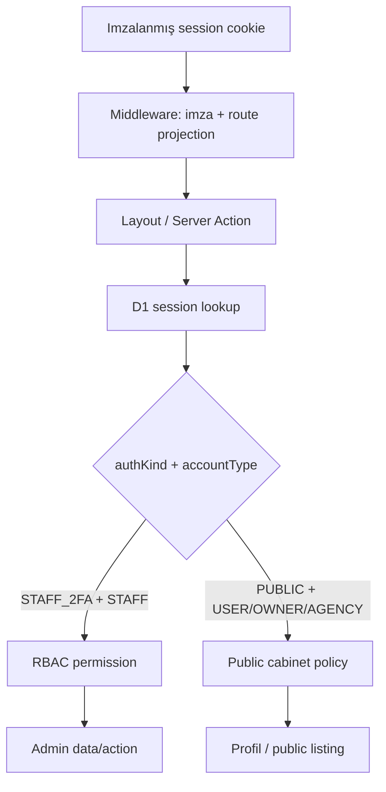
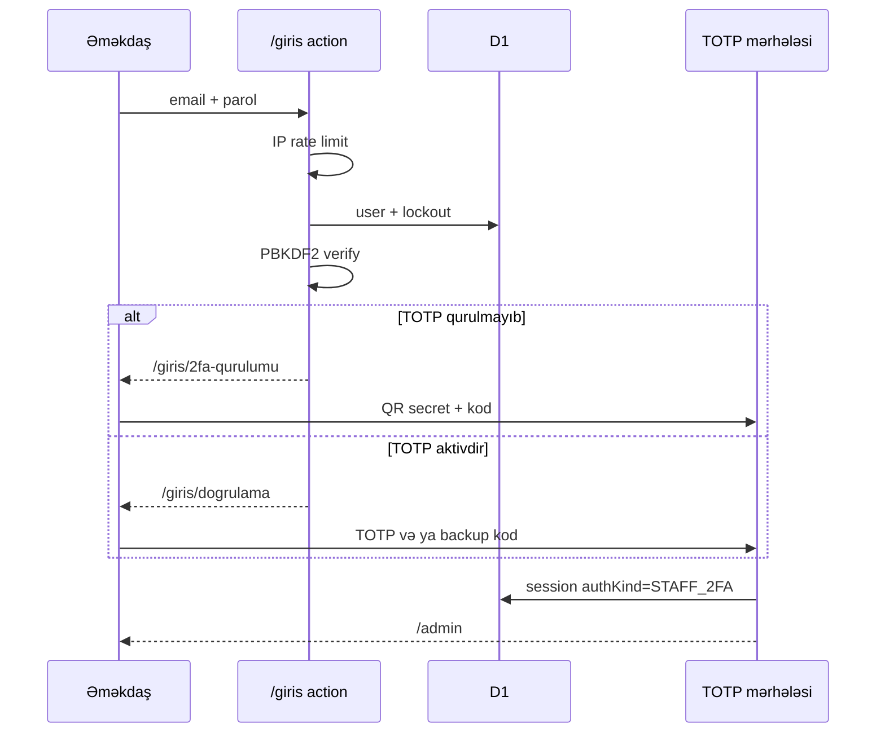

# Təhlükəsizlik və autentifikasiya

Layihə iki ayrı autentifikasiya məqsədini eyni sessiya infrastrukturunda saxlayır:

- **staff auth** — idarə paneli, məcburi TOTP 2FA və RBAC;
- **public auth** — istifadəçi kabineti, 2FA-sız, lakin staff panelindən sərt ayrılmış.

Zəifliyi açıq issue kimi paylaşmayın. Məsuliyyətli bildiriş üçün repozitoriyadakı [`SECURITY.md`](https://github.com/MuradoffTehmez/LuxeHome/blob/main/SECURITY.md) siyasətinə baxın.

## Təhlükəsizlik modeli

Middleware ucuz imza və route proyeksiya yoxlaması aparır. Həqiqi təhlükəsizlik sərhədi layout, Server Action və Route Handler-də D1 sessiyasının yenidən oxunmasıdır. Beləliklə revoke edilmiş sessiya və deaktiv istifadəçi middleware cookie-si etibarlı görünsə belə qorunan əməliyyata çata bilmir.

## Parol saxlanması

Parollar Web Crypto PBKDF2 ilə hash olunur:

| Parametr | Dəyər |
|---|---|
| Alqoritm | PBKDF2-HMAC-SHA256 |
| Iterasiya | 100 000 |
| Salt | 16 random byte |
| Açar | 256 bit |
| Format | `pbkdf2$sha256$iterations$salt$hash` |

100 000 iterasiya Cloudflare Workers production runtime limitinə uyğun seçilib. Format iterasiya sayını saxladığı üçün `needsRehash()` gələcək parametr artımında uğurlu girişdən sonra hash-i yeniləyə bilir.

Password verification pozulmuş format və runtime kripto xətasında exception sızdırmır; sadəcə uyğunsuz nəticə qaytarır. Login user enumeration-ı azaltmaq üçün mövcud olmayan user-də dummy hash hesablayır.

## Staff giriş axını

### TOTP müdafiələri

- secret random yaradılır;
- `AUTH_SECRET`-dən HKDF ilə məqsəd-spesifik açar törədilir;
- secret AES-GCM ilə şifrələnib D1-də saxlanılır;
- doğrulama ±1 zaman addımına icazə verir;
- uğurlu TOTP counter sessiyada saxlanılır və 30 saniyə içində replay bloklanır;
- 10 yüksək entropiyalı backup kodun yalnız SHA-256 hash-i saxlanılır;
- backup kod birdəfəlikdir;
- enrollment tamamlanana qədər admin sessiyası yaranmır.

### Hesab kilidi

- 5 uğursuz cəhd → 15 dəqiqə lockout;
- IP üçün `LOGIN_LIMIT`: 10 sorğu / 60 saniyə;
- login nəticəsi `LoginAttempt` modelində qeyd olunur;
- passiv və kilidli user üçün sessiya yaranmır;
- uğurlu giriş failure sayğacını sıfırlayır.

## Public hesab axını

`/qeydiyyat` və `/daxil-ol` yalnız `USER`, `OWNER`, `AGENCY` hesabları üçün `PUBLIC` sessiyası yaradır.

Staff hesabı public login formunda düzgün parol versə belə public sessiya almır. Əks istiqamətdə public sessiya da `/admin` üçün yararlı deyil. Qoruma iki proyeksiyanı birlikdə tələb edir:

| Hədəf | `accountType` | `authKind` |
|---|---|---|
| Admin | `STAFF` | `STAFF_2FA` |
| Kabinet | `USER`, `OWNER`, `AGENCY` | `PUBLIC` |

`OWNER` və `AGENCY` elan/media mutation-ı üçün əlavə `requireLister()` yoxlamasından keçir. `USER` profil kabinetinə daxil ola bilər, amma elan yerləşdirə bilməz.

Hazırkı public auth məhdudiyyətləri:

- e-poçt təsdiqi yoxdur;
- parol bərpa axını yoxdur;
- public hesab üçün 2FA seçimi yoxdur;
- qeydiyyat və login eyni IP limiter-i paylaşır.

## Sessiya siyasəti

Sessiya state-i D1-də saxlanılır; cookie yalnız imzalanmış proyeksiya daşıyır.

| Parametr | Dəyər |
|---|---|
| Sliding lifetime | 8 saat |
| Absolute lifetime | 7 gün |
| Cookie | `HttpOnly`, `Secure`, `SameSite=Lax`, `Path=/` |
| JWT | HS256, issuer və subject məcburi |
| Revoke | Bir sessiya, digər sessiyalar və ya user-in bütün sessiyaları |

Hər istifadə zamanı `touchSession()` expiry-ni uzadır, lakin absolute həddi keçmir. Password dəyişəndə cari sessiya saxlanılır, digər sessiyalar revoke edilir. Staff admin panelindən ayrıca sessiyanı və ya bütün digər sessiyaları bağlaya bilər.

JWT içindəki `uid`, `role`, `accountType` və `authKind` D1 sessiya/user proyeksiyası ilə uyğun gəlməlidir. Role və hesab növü dəyişdikdə köhnə cookie yeni səlahiyyət kimi qəbul edilmir.

## Middleware və route qoruması

`src/middleware.ts` aşağıdakı route-larda işləyir:

- `/admin` və alt marşrutlar;
- `/giris` və alt marşrutlar;
- `/kabinet` və alt marşrutlar.

`ADMIN_ENABLED !== "true"` olduqda admin və staff login route-ları 404 görünüşünə rewrite edilir. Aktiv olduqda sessiyasız admin sorğusu `/giris?davam=...`-a yönləndirilir.

Middleware bütün matched response-lara admin sərtləşdirmə header-ları əlavə edir. Kabinet də matcher-də olduğu üçün eyni `no-store` və security header-ları alır.

## RBAC

### Permission-lar

- `property:manage`;
- `project:manage`;
- `service:manage`;
- `blog:manage`;
- `lead:manage`;
- `media:manage`;
- `user:manage`;
- `settings:manage`.

### Rol matrisi

| Rol | Səlahiyyət |
|---|---|
| `SUPER_ADMIN` | Bütün permission-lar |
| `ADMIN` | Property, project, service, blog, lead, media |
| `EDITOR` | Blog və media |

Layout yoxlaması kifayət sayılmır: Server Action birbaşa POST ilə çağırıla bildiyi üçün hər mutation öz permission guard-ını çağırır.

## CSRF və yazı limiti

`requireAdminAction()` və `requirePublicAction()`:

1. `Sec-Fetch-Site` dəyərinin `same-origin` və ya `none` olmasını tələb edir;
2. `Origin` varsa host ilə eyni olmasını tələb edir;
3. canlı D1 sessiyası və hesab proyeksiyasını yoxlayır;
4. scope + user ID əsasında `ADMIN_LIMIT` tətbiq edir.

Next.js Server Actions üçün `allowedOrigins` siyahısı yalnız production, staging və lokal domenlərdən ibarətdir.

## HTTP başlıqları

Admin/staff/kabinet matcher-i üçün:

- CSP: `default-src 'self'`, `object-src 'none'`, `frame-ancestors 'none'`, `form-action 'self'`;
- `X-Frame-Options: DENY`;
- `X-Content-Type-Options: nosniff`;
- `Referrer-Policy: no-referrer`;
- məhdud `Permissions-Policy`;
- `Cache-Control: no-store, max-age=0`.

Ümumi Next.js header-ları `nosniff`, `SAMEORIGIN`, strict-origin referrer və kamera/mikrofon/geolocation/payment qadağası verir. `poweredByHeader` söndürülüb.

CSP `script-src` və `style-src` üçün Next.js hydration və inline stillər səbəbindən `'unsafe-inline'` saxlayır. Bu, müdafiənin məlum kompromisidir.

## Media upload təhlükəsizliyi

Upload endpoint-ləri aşağıdakıları yoxlayır:

- admin üçün `media:manage`, public üçün lister hesabı;
- same-origin və yazı sürət limiti;
- boş fayl və 8 MB maksimum ölçü;
- JPEG/PNG/WebP/AVIF magic-byte;
- SVG və başqa formatların rəddi;
- serverdə yaranan UUID əsaslı key;
- original adın yol kimi istifadə edilməməsi;
- public upload-da hər `Media` sətrinin `uploaderId` ownership-i;
- public property yaratmada bütün image URL-lərin həmin user-ə aid olması;
- R2 yazısından sonra DB xətasında rollback.

## Rich-text və input təhlükəsizliyi

- Admin formaları Zod schema-ları ilə doğrulanır.
- Bloq və uzun HTML sahələr UltraHTML allowlist sanitizasiyasından keçir.
- Public property action admin-only sahələri schema-dan çıxarır və server dəyəri təyin edir.
- Slug serverdə yaradılır və uniqueness yoxlanır.
- Relation ID-ləri type/location/feature cədvəllərinə qarşı doğrulanır.
- Audit log kritik admin mutation-larında actor, action, entity və summary saxlayır.

## İnfrastruktur izolyasiyası

Staging və production ayrı Worker, D1, media R2, cache R2 və rate-limit namespace istifadə edir. Staging `IS_STAGING=true` ilə bütün metadata-nı noindex edir və robots bütün route-ları bloklayır.

Secret-lər:

- Git və `wrangler.jsonc` daxilində saxlanmır;
- production və staging üçün ayrı olmalıdır;
- `AUTH_SECRET` dəyişməsi mövcud session JWT-lərini və TOTP şifrələməsini təsir edir;
- rotasiya versiyalı açar və keçid planı olmadan aparılmamalıdır.

## Məlum təhlükəsizlik boşluqları

| Prioritet | Boşluq | Risk |
|---|---|---|
| P0 | Əlaqə action-ında `CONTACT_LIMIT`, honeypot və Turnstile yoxdur | Spam və Resend/D1 sui-istifadəsi |
| P1 | Public e-poçt təsdiqi yoxdur | Saxta və ya səhv ünvanlı hesablar |
| P1 | Parol bərpası yoxdur | Support müdaxiləsi və hesab əlçatanlığı |
| P1 | GitHub Actions CI və E2E yoxdur | Auth/deploy regression-u gec aşkarlanır |
| P1 | `AUTH_SECRET` üçün versiyalı rotasiya yoxdur | Rotasiya TOTP və session-ları kəsir |
| P2 | CSP-də `'unsafe-inline'` var | XSS müdafiəsi ideal strict səviyyədə deyil |
| P2 | Login və qeydiyyat eyni limiter-i paylaşır | Abuse siyasəti incə tənzimlənməyib |

Bu siyahı zəifliyin istismar təlimatı deyil; texniki borcun prioritet xəritəsidir.
