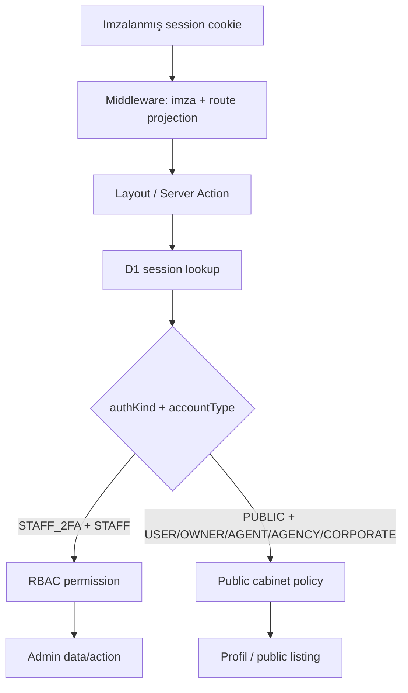
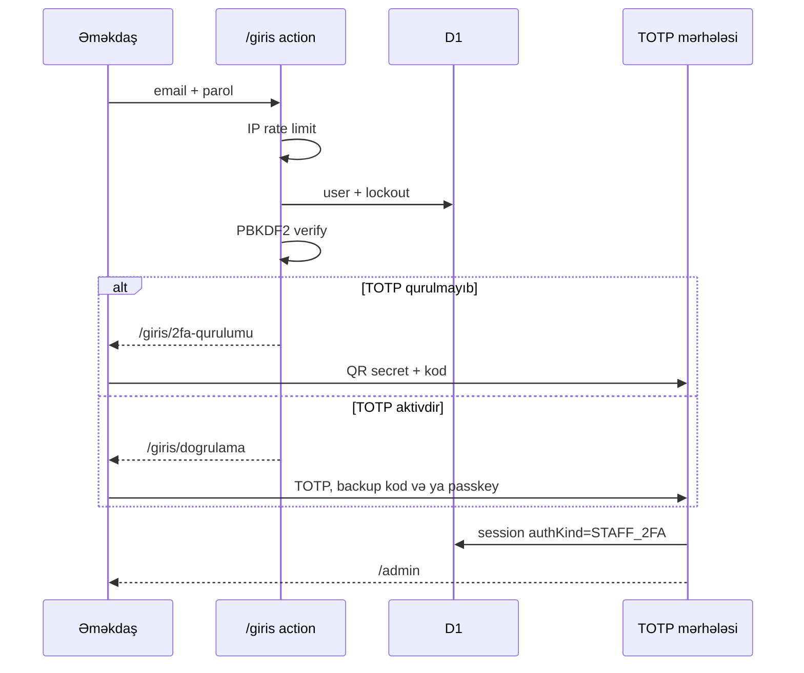

# Təhlükəsizlik və autentifikasiya

Layihə iki ayrı autentifikasiya məqsədini eyni sessiya infrastrukturunda saxlayır:

- **staff auth** — idarə paneli, məcburi TOTP 2FA (passkey alternativ ikinci mərhələdir) və RBAC;
- **public auth** — istifadəçi kabineti; parol, Google (OIDC) və təsdiqlənmiş telefonla OTP girişi; staff panelindən sərt ayrılmış.

Zəifliyi açıq issue kimi paylaşmayın. Məsuliyyətli bildiriş üçün repozitoriyadakı [`SECURITY.md`](https://github.com/MuradoffTehmez/LuxeHome/blob/main/SECURITY.md) siyasətinə baxın.

## Təhlükəsizlik modeli

```mermaid
flowchart TD
    C[Imzalanmış session cookie] --> M[Middleware: imza + route projection]
    M --> L[Layout / Server Action]
    L --> D[D1 session lookup]
    D --> A{authKind + accountType}
    A -->|STAFF_2FA + STAFF| R[RBAC permission]
    A -->|PUBLIC + USER/OWNER/AGENT/AGENCY/CORPORATE| P[Public cabinet policy]
    R --> X[Admin data/action]
    P --> Y[Profil / public listing]
```

Middleware ucuz imza və route proyeksiya yoxlaması aparır. Həqiqi təhlükəsizlik sərhədi layout, Server Action və Route Handler-də D1 sessiyasının yenidən oxunmasıdır. Beləliklə revoke edilmiş sessiya və deaktiv istifadəçi middleware cookie-si etibarlı görünsə belə qorunan əməliyyata çata bilmir.

## Parol saxlanması

Parollar Web Crypto PBKDF2 ilə hash olunur:

| Parametr | Dəyər |
|---|---|
| Alqoritm | PBKDF2-HMAC-SHA256 |
| Iterasiya | 100 000 |
| Salt | 16 random byte |
| Açar | 256 bit |
| Format | `pbkdf2$sha256$iterations$salt$hash` |

100 000 iterasiya Cloudflare Workers runtime-ının yuxarı həddidir; daha böyük dəyər `deriveBits()`-də `NotSupportedError` atır və düzgün parolu da rədd edir. Hədd OWASP tövsiyəsindən (600 000) aşağı olduğu üçün kompensasiya parol uzunluğundadır: `STAFF_PASSWORD_MIN = 12`, `PUBLIC_PASSWORD_MIN = 10`. Format iterasiya sayını saxladığı üçün `needsRehash()` gələcək parametr artımında uğurlu girişdən sonra hash-i yeniləyə bilir.

Password verification pozulmuş format və runtime kripto xətasında exception sızdırmır; sadəcə uyğunsuz nəticə qaytarır. Login user enumeration-ı azaltmaq üçün mövcud olmayan user-də dummy hash hesablayır.

## Staff giriş axını

```mermaid
sequenceDiagram
    participant U as Əməkdaş
    participant L as /giris action
    participant DB as D1
    participant T as TOTP mərhələsi

    U->>L: email + parol
    L->>L: IP rate limit
    L->>DB: user + lockout
    L->>L: PBKDF2 verify
    alt TOTP qurulmayıb
        L-->>U: /giris/2fa-qurulumu
        U->>T: QR secret + kod
    else TOTP aktivdir
        L-->>U: /giris/dogrulama
        U->>T: TOTP, backup kod və ya passkey
    end
    T->>DB: session authKind=STAFF_2FA
    T-->>U: /admin
```

### TOTP müdafiələri

- secret random yaradılır;
- `AUTH_SECRET`-dən HKDF ilə məqsəd-spesifik açar törədilir;
- secret AES-GCM ilə şifrələnib D1-də saxlanılır;
- doğrulama ±1 zaman addımına icazə verir;
- uğurlu TOTP counter sessiyada saxlanılır və 30 saniyə içində replay bloklanır;
- 10 yüksək entropiyalı backup kodun yalnız SHA-256 hash-i saxlanılır;
- backup kod birdəfəlikdir;
- enrollment tamamlanana qədər admin sessiyası yaranmır.

### Passkey (WebAuthn)

- `@simplewebauthn/server` ilə (workerd-də test olunub); girişin ikinci mərhələsində TOTP-a **alternativdir**, onu əvəz etmir — TOTP məcburi qalır;
- RP ID `Host`-dan götürülür, amma yalnız layihənin domenlərindən (`passkey-policy.ts`);
- challenge imzalı, birdəfəlik `lhe_webauthn` cookie-sindədir; `userVerification: "required"`;
- passkey domenə bağlıdır: `luxehomeestate.az`-da yaradılan açar workers.dev-də işləmir.

`?davam=` parametri aralıq cookie-nin içində daşınır və yalnız `/admin` ilə başlayan marşrutlar qəbul edilir (açıq yönləndirmə qorunması).

### Hesab kilidi

- 5 uğursuz cəhd → 15 dəqiqə lockout;
- IP üçün `LOGIN_LIMIT`: 10 sorğu / 60 saniyə;
- login nəticəsi `LoginAttempt` modelində qeyd olunur;
- passiv və kilidli user üçün sessiya yaranmır;
- uğurlu giriş failure sayğacını sıfırlayır.

## Public hesab axını

`/{locale}/qeydiyyat` və `/{locale}/daxil-ol` yalnız ictimai hesab növləri (`PUBLIC_ACCOUNT_TYPES`: `USER`, `OWNER`, `AGENT`, `AGENCY`, `CORPORATE`) üçün `PUBLIC` sessiyası yaradır. Parol, Google və telefon girişi eyni `openPublicSession()` (`public-session.ts`) yolundan keçir — yeni ictimai giriş axını da onu işlətməlidir.

### Google ilə giriş

- `GOOGLE_CLIENT_ID`/`GOOGLE_CLIENT_SECRET` olmayanda tam söndürülüdür (düymə yox, marşrut 404);
- OIDC + PKCE + nonce, state imzalı `lhe_oauth` cookie-sində;
- bağlama qaydaları `google-login-policy.ts`-dədir: əməkdaş heç vaxt bağlanmır, yalnız `email_verified` qəbul olunur, təsdiqlənməmiş mövcud hesaba bağlananda parol ləğv olunur (pre-hijacking müdafiəsi);
- yönləndirmə ünvanı: `<SITE_URL>/api/auth/google/callback`.

### Telefonla OTP girişi

- `SMS_PROVIDER_URL`/`SMS_PROVIDER_TOKEN` olmayanda söndürülüdür;
- yalnız kabinetdə SMS ilə **təsdiqlənmiş** nömrə (`User.verifiedPhone`, unikal) ilə giriş; nömrə ilə hesab yaranmır, cavab nömrənin qeydiyyatda olduğunu bildirmir;
- kod HMAC-lə saxlanılır: 5 dəqiqə / 5 cəhd, 60 s fasilə, saatda 5 kod; göndəriş Turnstile ilə qorunur;
- profildə nömrə dəyişəndə təsdiq sıfırlanır; provayder API-si fərqlidirsə yalnız `src/lib/sms.ts` dəyişir.

Staff hesabı public login formunda düzgün parol versə belə public sessiya almır. Əks istiqamətdə public sessiya da `/admin` üçün yararlı deyil. Qoruma iki proyeksiyanı birlikdə tələb edir:

| Hədəf | `accountType` | `authKind` |
|---|---|---|
| Admin | `STAFF` | `STAFF_2FA` |
| Kabinet | `USER`, `OWNER`, `AGENT`, `AGENCY`, `CORPORATE` | `PUBLIC` |

Elan yerləşdirə bilən hesablar (`LISTING_ACCOUNT_TYPES`) elan/media mutation-ı üçün əlavə `requireLister()` yoxlamasından keçir. `USER` profil kabinetinə daxil ola bilər, amma elan yerləşdirə bilməz.

İctimai hesabın biznes təsdiqi `approvedAt`, girişə buraxılması isə `isActive` ilə ayrıca idarə olunur. Beləliklə hesab bloklanmadan təsdiq gözləyə və ya əvvəl təsdiqlənmiş hesab ayrıca deaktiv edilə bilər. Agentlik üçün public verification əlavə olaraq `Agency.isVerified` tələb edir.

Public hesabın bərpa və məlumat hüquqları:

- e-poçt təsdiqi və parol bərpası tokenləri (`EmailVerificationToken`, `PasswordResetToken`);
- şəxsi data ixracı (`/api/hesab/export`);
- self-service silinmə **iki mərhələlidir**: əvvəl `isActive = false` və `deletionRequestedAt` eyni `User.update`-da yazılır, sonra elanlar arxivlənib hesab silinir. İkinci mərhələ alınmasa `runPhase2Maintenance()` marker-li hesabı idempotent yenidən sınayır. Admin paneldən hesab/agentlik silinməsi də eyni `requestAccountDeletion()` yolundan keçir.

Hazırkı məhdudiyyətlər: public hesab üçün 2FA seçimi yoxdur; qeydiyyat və login eyni IP limiter-i paylaşır.

## Sessiya siyasəti

Sessiya state-i D1-də saxlanılır; cookie yalnız imzalanmış proyeksiya daşıyır.

| Parametr | Dəyər |
|---|---|
| Sliding lifetime | 8 saat |
| Absolute lifetime | 7 gün |
| Cookie | `HttpOnly`, `Secure`, `SameSite=Lax`, `Path=/` |
| JWT | HS256, issuer və subject məcburi |
| Revoke | Bir sessiya, digər sessiyalar və ya user-in bütün sessiyaları |

Hər istifadə zamanı `touchSession()` expiry-ni uzadır, lakin absolute həddi keçmir. Password dəyişəndə cari sessiya saxlanılır, digər sessiyalar revoke edilir. Staff admin panelindən ayrıca sessiyanı və ya bütün digər sessiyaları bağlaya bilər.

JWT içindəki `uid`, `role`, `accountType` və `authKind` D1 sessiya/user proyeksiyası ilə uyğun gəlməlidir. Role və hesab növü dəyişdikdə köhnə cookie yeni səlahiyyət kimi qəbul edilmir.

## Middleware və route qoruması

`src/middleware.ts`-in matcher-i `/sitemap.xml` və `api`, `_next`, `media`, `llms.txt` və uzantılı fayllardan başqa bütün yolları əhatə edir. Sorğu bu ardıcıllıqla emal olunur:

1. **Kanonik host** (`seo-host.ts`) — production-da `https://luxehomeestate.az` olmayan hər host/protokol (`www.`, `workers.dev`, `http`) 308 ilə kanonik ünvana yönləndirilir; staging-də bu addım söndürülüdür.
2. **Texniki xidmət qapısı** (`maintenanceGate`) — `MAINTENANCE` rejimində ictimai səth 503 texniki xidmət səhifəsi alır; yalnız `SUPER_ADMIN` və sistem üçün zəruri marşrutlar keçir.
3. `/sitemap.xml` daxildə `/sitemap-index.xml`-ə rewrite olunur.
4. `/{locale}/admin/...` ünvanları 308 ilə canonical `/admin/...`-ə keçir.
5. Hesab axını olmayan marşrutlar `next-intl` middleware-indən keçir, `Content-Language` və ictimai CSP alır; staging-də `X-Robots-Tag: noindex, nofollow` əlavə olunur.
6. Admin və staff giriş marşrutları: `ADMIN_ENABLED !== "true"` olduqda bağlı səhifəyə (`/__baglidir`) rewrite edilir.
7. **Cloudflare Access (Zero Trust)** — `ACCESS_ENFORCED="true"`, `ACCESS_TEAM_DOMAIN` və `ACCESS_AUD` verilibsə, admin/staff giriş marşrutları `cf-access-jwt-assertion` JWT-si doğrulanmadan 403 qaytarır. Konfiqurasiya natamamdırsa qapı söndürülüdür və panel sessiya müdafiəsi ilə işləyir.
8. İmzalanmış sessiya cookie-si oxunur və lazım olduqda `/{locale}/giris?davam=...` və ya ictimai girişə yönləndirilir.
9. Admin, staff giriş və kabinet cavablarına sərtləşdirmə başlıqları (`harden()`) əlavə olunur.

Dil yalnız URL prefiksindən oxunur; `NEXT_LOCALE` cookie-si qəsdən işlədilmir, çünki hər ictimai cavaba `Set-Cookie` əlavə edib kənar keşi bağlayırdı.

## RBAC

### Permission-lar

- `property:manage`;
- `project:manage`;
- `service:manage`;
- `blog:manage`;
- `lead:manage`;
- `media:manage`;
- `user:manage`;
- `settings:manage`.
- `partner:view`, `partner:create`, `partner:update`, `partner:delete`;
- `partner:verify`, `partner:publish`, `partner:relationships`;
- `partner:contract` — kommersiya sirri olan müqavilə metadata-sı;
- `knowledge:manage`, `translation:manage`;
- `seo:view`, `seo:edit`, `seo:publish`, `seo:redirect:manage`, `seo:schema:manage`, `seo:settings:manage`;
- `billing:manage` — premium paketlər və ödəniş uçotu.

Cəmi 25 permission.

### Rol matrisi

| Rol | Səlahiyyət |
|---|---|
| `SUPER_ADMIN` | Bütün permission-lar, o cümlədən `user:manage`, `settings:manage`, `partner:contract`, `seo:settings:manage` və audit reset |
| `ADMIN` | Kontent, Bilik Mərkəzi, lead, media, tərcümə, müqavilə xaric tərəfdaş, SEO (parametrlər xaric), `billing:manage` |
| `EDITOR` | Bloq, Bilik Mərkəzi, media, tərcümə, tərəfdaş və SEO-ya read-only baxış |

Layout yoxlaması kifayət sayılmır: Server Action birbaşa POST ilə çağırıla bildiyi üçün hər mutation öz permission guard-ını çağırır.

## CSRF və yazı limiti

`requireAdminAction()` və `requirePublicAction()`:

1. `Sec-Fetch-Site` dəyərinin `same-origin` və ya `none` olmasını tələb edir;
2. `Origin` varsa host ilə eyni olmasını tələb edir;
3. canlı D1 sessiyası və hesab proyeksiyasını yoxlayır;
4. scope + user ID əsasında `ADMIN_LIMIT` tətbiq edir.

Next.js Server Actions üçün `allowedOrigins` siyahısı yalnız production, staging və lokal domenlərdən ibarətdir.

Əlaqə forması çoxqatlı spam qapısı istifadə edir: görünməz `website` honeypot-u, same-origin yoxlaması, IP əsaslı `CONTACT_LIMIT` və Cloudflare Turnstile. Honeypot doludursa botu məlumatlandırmamaq üçün saxta uğur qaytarılır. Sahələrin yuxarı həddi var (ad/telefon/e-poçt/mövzu/mesaj: 120/40/200/200/4000), mənbə allowlist-dən keçir (`CONTACT` | `OWNER`).

### Turnstile

Gizli açar runtime-da əvvəl `TURNSTILE_SECRET`, yoxdursa `TURNSTILE_SECRET_KEY` adı ilə oxunur (`src/lib/auth/turnstile.ts`). Turnstile əlaqə, qeydiyyat, ictimai giriş, staff girişi, telefon OTP göndərişi, açıq qapı qeydiyyatı və hesab təhlükəsizliyi formalarına bağlıdır. Gizli açar Worker secret-idir, hostname allowlist mühitdə saxlanılır. **Test bypass-ı qəsdən yoxdur** — E2E admin stage cookie ilə TOTP addımından real keçir. Konteyner 300px-dən dar olanda widget `compact` ölçüyə keçir.

### Sistem rejimləri

`/admin/sistem`-dən `NORMAL`, `MAINTENANCE` (ictimai səthin hamısı 503 texniki xidmət səhifəsinə düşür, yalnız `SUPER_ADMIN` keçir) və `READ_ONLY` (səhifələr göstərilir, server action və API mutasiyaları rədd edilir) rejimləri seçilir. Rejim `Setting` cədvəlində JSON kimi saxlanılır (`src/lib/system-mode.ts`) və hər dəyişiklik `SYSTEM_MODE_CHANGE` audit qeydi yaradır.

`FORCE_MAINTENANCE="true"` Worker dəyişəni bazadakı parametri **yan keçir**: D1-in özü əlçatmaz olanda və ya panelə girmək mümkün olmayanda saytı texniki xidmətə salmağın yeganə yoludur. Bu rejimdə kənar HTML keşi də söndürülür.

## HTTP başlıqları

Admin, staff giriş və kabinet üçün (`harden()`):

- CSP: `default-src 'self'`, `base-uri 'self'`, `object-src 'none'`, `frame-ancestors 'none'`, `form-action 'self'`; skript yalnız öz mənşəyimiz, Turnstile və Cloudflare Insights-dan; şəkil `images.unsplash.com`, `media.luxehomeestate.az`, `treva.realestate` və OSM tile ehtiyatından;
- `X-Frame-Options: DENY`;
- `X-Content-Type-Options: nosniff`;
- `Referrer-Policy: no-referrer`;
- `Permissions-Policy: camera=(), microphone=(), geolocation=(self), payment=(), usb=()` — `geolocation=(self)` elan formasındakı «cari yerimi götür» düyməsi üçündür;
- `Cache-Control: no-store, max-age=0`.

İctimai səhifələr üçün (`hardenPublic()`) yalnız CSP əlavə olunur və `Cache-Control`-a qəsdən toxunulmur (ISR keşi söndürülməsin):

- `frame-ancestors 'self'` (önbaxış freymi üçün), `base-uri`, `object-src 'none'`, `form-action 'self'`;
- skript/bağlantı: Turnstile, Cloudflare Insights, Google Tag Manager və Google Analytics;
- `frame-src`: Turnstile, GTM `noscript`, `youtube-nocookie.com`, `player.vimeo.com`, 360° tur platformaları (`kuula.co`, `my.matterport.com`, `momento360.com`).

Ümumi Next.js header-ları `nosniff`, `SAMEORIGIN`, strict-origin referrer və kamera/mikrofon/geolocation/payment qadağası verir. `poweredByHeader` söndürülüb.

CSP `script-src` və `style-src` üçün Next.js hydration və inline stillər səbəbindən `'unsafe-inline'` saxlayır. Bu, müdafiənin məlum kompromisidir.

## Media upload təhlükəsizliyi

Upload endpoint-ləri aşağıdakıları yoxlayır:

- admin üçün `media:manage`, public üçün lister hesabı;
- same-origin və yazı sürət limiti;
- boş fayl və 8 MB maksimum ölçü;
- JPEG/PNG/WebP/AVIF magic-byte;
- SVG və başqa formatların rəddi;
- serverdə yaranan UUID əsaslı key;
- original adın yol kimi istifadə edilməməsi;
- public upload-da hər `Media` sətrinin `uploaderId` ownership-i;
- public property yaratmada bütün image URL-lərin həmin user-ə aid olması;
- R2 yazısından sonra DB xətasında rollback.

## Rich-text və input təhlükəsizliyi

- Admin formaları Zod schema-ları ilə doğrulanır.
- Bloq və uzun HTML sahələr UltraHTML allowlist sanitizasiyasından keçir.
- Public property action admin-only sahələri schema-dan çıxarır və server dəyəri təyin edir.
- Slug serverdə yaradılır və uniqueness yoxlanır.
- Relation ID-ləri type/location/feature cədvəllərinə qarşı doğrulanır.
- Audit log kritik admin mutation-larında actor, action, entity və summary saxlayır.
- Audit snapshot-ları həssas sahələri maskalayır; jurnalı yalnız Super Admin sıfırlaya bilər və reset özü audit kimi qalır.
- Resend webhook yalnız Svix imzası `RESEND_WEBHOOK_SECRET` ilə doğrulandıqda `EmailActivity` yazır; məktub body-si saxlanılmır.
- Saved-search cron endpoint-i yalnız timing-safe müqayisədən keçən `CRON_SECRET` Bearer dəyərini qəbul edir, secret yoxdursa 404 qaytarır; dəyər `runtimeEnv()` ilə oxunur.
- E-poçt şablonlarında bütün istifadəçi mətni `src/lib/email-html.ts` (`escapeHtml`, `emailHref`, `telHref`) ilə kodlanır; `href` sxem allowlist-indən keçir.
- Telegram bildirişində ziyarətçi mətni `escapeHtml()`-dən keçir (HTML `parse_mode`).
- Push abunəliyində yalnız `https` endpoint və 800 simvol həddi qəbul olunur; `global_fetch_strictly_public` daxili şəbəkəni əlavə olaraq bağlayır.
- Toplu admin əməliyyatları hər id üçün mövcud tək action-u çağırır — guard, audit və keş invalidasiyası yan keçilmir; bir sorğuda ən çox 100 id.
- CSV idxalında kənar şəkil `readLimited()` ilə axın oxunarkən ölçü limitinə tabedir.
- Kənar HTML keşi sessiya/2FA/preview cookie-li sorğunu keşləmir və `Set-Cookie` saxlamır.

## İnfrastruktur izolyasiyası

Staging və production ayrı Worker, D1, media R2, cache R2 və rate-limit namespace istifadə edir. Staging `IS_STAGING=true` ilə bütün metadata-nı noindex edir və robots bütün route-ları bloklayır.

Secret-lər:

- Git və `wrangler.jsonc` daxilində saxlanmır;
- production və staging üçün ayrı olmalıdır;
- `AUTH_SECRET` dəyişməsi mövcud session JWT-lərini və TOTP şifrələməsini təsir edir;
- rotasiya versiyalı açar və keçid planı olmadan aparılmamalıdır.

## Məlum təhlükəsizlik boşluqları

| Prioritet | Boşluq | Risk |
|---|---|---|
| P1 | `AUTH_SECRET` üçün versiyalı rotasiya yoxdur | Rotasiya TOTP və session-ları kəsir |
| P1 | `RESEND_WEBHOOK_SECRET` production-da ayrıca qurulmalıdır | Qurulmasa e-poçt event jurnalı 503 ilə bağlı qalır |
| P2 | CSP-də `'unsafe-inline'` var | XSS müdafiəsi ideal strict səviyyədə deyil |
| P2 | Login və qeydiyyat eyni limiter-i paylaşır | Abuse siyasəti incə tənzimlənməyib |
| P2 | PBKDF2 100 000 iterasiya (Workers həddi) | Kompensasiya: parol minimumları 12/10 simvol |
| P2 | Public hesab üçün 2FA seçimi yoxdur | Hesab ələ keçirilməsinə qarşı əlavə qat yoxdur |

Bağlanmış keçmiş boşluqlar: Turnstile, e-poçt təsdiqi, parol bərpası, CI və browser E2E (sentyabr 2026). 20 sentyabr təhlükəsizlik auditinin 5 tapıntısı (e-poçt HTML injeksiyası, tile kvotası, AI kvotası, əlaqə sahə hədləri, push endpoint) bağlanıb.

Bu siyahı zəifliyin istismar təlimatı deyil; texniki borcun prioritet xəritəsidir.
